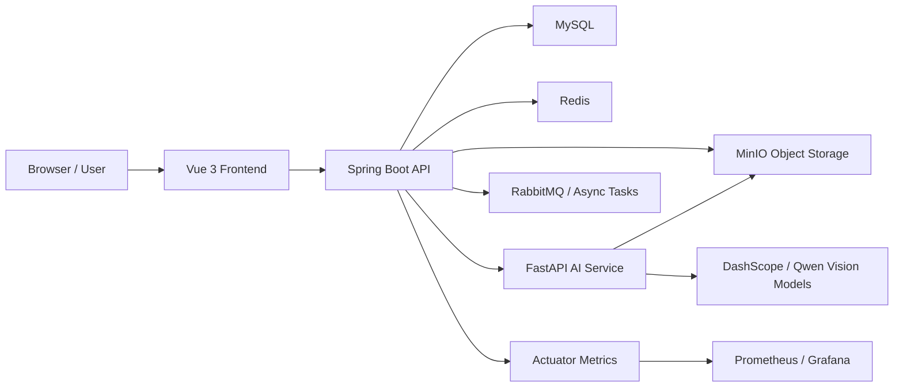

# Cloud Album

Cloud Album 是一个面向个人与家庭影像资产管理的智能云相册系统。它将 Web 相册、对象存储、异步任务和 AI 视觉能力组合在一起，支持照片/视频管理、相册整理、分享链接、回收站、多维度浏览、相似图片检索、AI 标签识别和人脸分析。

这个项目适合作为私有化相册、全栈 Web 应用、对象存储集成、异步任务治理和 AI 图像能力落地的学习与二次开发样例。

## 功能亮点

- 影像管理：支持图片和视频上传、预览、下载、删除、回收站恢复与彻底删除。
- 相册组织：支持普通相册，以及按人物、地点、设备、标签等维度浏览媒体内容。
- 分享能力：支持生成分享链接、保存分享内容、复制分享地址。
- 智能识别：通过独立 AI 服务完成图片标签识别、图片特征提取、人脸检测和人脸特征分析。
- 相似检索：支持相似图片检测和以图搜图，便于去重、归类和发现相关影像。
- 数据统计：提供文件、地点、标签等维度的数据可视化。
- 账号体系：包含注册登录、邮箱验证码、登录鉴权、容量管理和会员状态。
- 运维能力：提供异步任务重试、死信处理、历史任务补偿扫描、Actuator 指标和 Prometheus/Grafana 观测配置。
- 智能体入口：可按需接入 Dify 或其他外部智能体页面。

## 技术栈

| 模块 | 技术 |
| --- | --- |
| 前端 | Vue 3, Vite, TypeScript, Element Plus, ECharts |
| 后端 | Java 17, Spring Boot 3.4, MyBatis-Plus, Sa-Token, RabbitMQ, Resilience4j |
| AI 服务 | Python, FastAPI, Uvicorn, DashScope / 阿里云百炼, MinIO SDK |
| 基础设施 | MySQL, Redis, MinIO, RabbitMQ |
| 可观测性 | Spring Boot Actuator, Prometheus, Alertmanager, Grafana |

## 系统架构



## 项目结构

```text
Cloud-Album/
├─ ai-service/          # Python FastAPI AI 推理服务
├─ backend/             # Spring Boot 后端服务
├─ frontend/            # Vue 前端应用
├─ docs/                # Dify/智能体相关文档
├─ ops/observability/   # Prometheus、Alertmanager、Grafana 本地配置
├─ scripts/             # 辅助脚本
├─ .env.example         # 环境变量示例，不包含真实密钥
└─ README.md
```

## 环境要求

- JDK 17+
- Maven 3.8+
- Node.js 18+（建议 20+）
- Python 3.10+
- MySQL 8+
- Redis
- MinIO
- RabbitMQ
- 阿里云百炼 DashScope API Key
- 高德地图 Web 服务 API Key（用于反向地理编码）
- 可发送 SMTP 邮件的邮箱授权码

## 环境变量

参考根目录的 `.env.example` 配置本地或服务器环境变量。

后端关键变量：

```env
DB_URL=jdbc:mysql://localhost:3306/memory_space
DB_USERNAME=root
DB_PASSWORD=

REDIS_HOST=localhost
REDIS_PORT=6379
REDIS_PASSWORD=
REDIS_DATABASE=0

RABBITMQ_HOST=localhost
RABBITMQ_PORT=5672
RABBITMQ_USERNAME=
RABBITMQ_PASSWORD=
RABBITMQ_VIRTUAL_HOST=/

MAIL_USERNAME=
MAIL_PASSWORD=
SA_TOKEN_JWT_SECRET=

MINIO_URL=http://127.0.0.1:9000
MINIO_ACCESS_KEY=
MINIO_SECRET_KEY=
MINIO_BUCKET=pictures

AMAP_API_KEY=
AI_SERVICE_URL=http://localhost:5000

FILE_TASK_CORE_POOL_SIZE=4
FILE_TASK_MAX_POOL_SIZE=8
FILE_TASK_QUEUE_CAPACITY=100
AI_BATCH_CORE_POOL_SIZE=4
AI_BATCH_MAX_POOL_SIZE=4
AI_BATCH_QUEUE_CAPACITY=50
ASYNC_TASK_MAX_RETRIES=5
ASYNC_TASK_SCAN_BATCH_SIZE=50
ASYNC_TASK_SCAN_DELAY_MS=30000
ASYNC_TASK_INITIAL_RETRY_DELAY_SECONDS=30
ASYNC_TASK_MAX_RETRY_DELAY_SECONDS=300
ASYNC_TASK_RUNNING_TIMEOUT_MINUTES=30
ASYNC_TASK_ADMIN_USER_IDS=
ASYNC_TASK_FACE_RECOVERY_ENABLED=true
ASYNC_TASK_FACE_RECOVERY_BATCH_SIZE=100
ASYNC_TASK_FACE_RECOVERY_CRON="0 0/50 * * * ?"
AI_FACE_TASK_VERSION=v1
ASYNC_TASK_VIDEO_VERSION=v1
ASYNC_TASK_VIDEO_RECOVERY_ENABLED=true
ASYNC_TASK_VIDEO_RECOVERY_BATCH_SIZE=50
ASYNC_TASK_VIDEO_RECOVERY_CRON="0 10/50 * * * ?"
ASYNC_TASK_VIDEO_TEMP_DIR=
ASYNC_TASK_GEO_RECOVERY_ENABLED=true
ASYNC_TASK_TAG_RECOVERY_ENABLED=false
AI_TAG_RUNNING_TIMEOUT_SECONDS=180

MANAGEMENT_ADDRESS=127.0.0.1
MANAGEMENT_PORT=8089
```

AI 服务关键变量：

```env
DASHSCOPE_API_KEY=
MINIO_ENDPOINT=127.0.0.1:9000
MINIO_ACCESS_KEY=
MINIO_SECRET_KEY=
MINIO_BUCKET=pictures

AI_SERVICE_HOST=0.0.0.0
AI_SERVICE_PORT=5000
AI_SERVICE_CORS_ALLOWED_ORIGINS=http://localhost:5173,http://localhost:8080
AI_MAX_CONCURRENCY=4
AI_CONCURRENCY_WAIT_SECONDS=5
AI_CONNECT_TIMEOUT_SECONDS=10
AI_REQUEST_TIMEOUT_SECONDS=60
AI_IMAGE_MAX_EDGE=1280
AI_IMAGE_MAX_PIXELS=1200000
AI_IMAGE_JPEG_QUALITY=82
```

前端变量：

```env
VITE_BACKEND_API=/devApi
VITE_AI_API=/mockApi
VITE_DIFY_AGENT_URL=
```

环境变量临时设置示例。

macOS / Linux：

```bash
export DB_PASSWORD="your-db-password"
export REDIS_PASSWORD="your-redis-password"
export SA_TOKEN_JWT_SECRET="your-long-random-secret"
export MINIO_ACCESS_KEY="your-minio-access-key"
export MINIO_SECRET_KEY="your-minio-secret-key"
export AMAP_API_KEY="your-amap-key"
export DASHSCOPE_API_KEY="your-dashscope-key"
```

Windows PowerShell：

```powershell
$env:DB_PASSWORD="your-db-password"
$env:REDIS_PASSWORD="your-redis-password"
$env:SA_TOKEN_JWT_SECRET="your-long-random-secret"
$env:MINIO_ACCESS_KEY="your-minio-access-key"
$env:MINIO_SECRET_KEY="your-minio-secret-key"
$env:AMAP_API_KEY="your-amap-key"
$env:DASHSCOPE_API_KEY="your-dashscope-key"
```

如果使用 IntelliJ IDEA 启动后端，配置系统环境变量后需要重启 IDEA，或直接在 Run/Debug Configuration 中填写 Environment variables。

## 启动基础服务

请先启动 MySQL、Redis、MinIO 和 RabbitMQ，并确保配置的账号、密码、bucket 与环境变量一致。

MinIO 需要创建对象存储 bucket，默认名称为：

```text
pictures
```

MySQL 默认数据库名称为：

```text
memory_space
```

数据库结构由 Flyway 自动管理。首次使用时只需要创建空库 `memory_space`，后端启动后会自动执行 `memory-backend/src/main/resources/db/migration` 下的迁移脚本。

- `V0__init_schema.sql`：完整基础表结构
- `V1` - `V4`：异步任务、性能索引、文件状态、事件 outbox 等增量迁移

RabbitMQ 用于异步任务分发。默认情况下，后端仍可使用本地扫描方式处理异步任务；如果启用 MQ 分发，请配置 RabbitMQ 连接信息并设置：

```env
ASYNC_TASK_MQ_ENABLED=true
```

## 启动后端

进入后端目录：

```bash
cd backend
```

启动：

```bash
mvn spring-boot:run
```

后端默认端口：

```text
http://localhost:8088
```

Swagger UI：

```text
http://localhost:8088/swagger-ui.html
```

Actuator 健康检查和 Prometheus 指标默认只监听本机管理端口：

```text
http://127.0.0.1:8089/actuator/health
http://127.0.0.1:8089/actuator/prometheus
```

### 异步任务运维接口

全局任务运维接口只允许 `ASYNC_TASK_ADMIN_USER_IDS` 中配置的已登录用户访问。
该变量为空时默认拒绝所有用户，多个 ID 使用英文逗号分隔。

主要接口：

- `GET /asyncTask/admin/list`：按状态、任务类型、用户和文件检索任务。
- `POST /asyncTask/admin/retry`：批量重试 `FAILED/DEAD` 任务，最多 100 个。
- `POST /asyncTask/admin/dead/cancel`：将无需继续处理的死信标记为 `CANCELLED`，保留审计记录。
- `GET /asyncTask/admin/recovery`：查询四类历史补偿扫描开关。
- `POST /asyncTask/admin/recovery/{taskType}/enabled`：运行时启停自动补偿扫描。
- `POST /asyncTask/admin/recovery/{taskType}/run`：立即执行一批补偿扫描。

运行时扫描开关当前保存在单个 JVM 内存中，应用重启后恢复环境变量配置。多实例部署前
应将开关迁移到共享配置中心，并配合分布式调度锁。

## 启动 AI 服务

进入 AI 服务目录：

```bash
cd ai-service
```

安装依赖：

```bash
pip install -r requirements.txt
```

启动：

```bash
python run.py
```

`run.py` 默认启动 FastAPI。开发环境也可以直接运行：

```bash
uvicorn app.main:app --host 0.0.0.0 --port 5000
```

AI 服务默认端口：

```text
http://localhost:5000
```

健康检查：

```text
GET http://localhost:5000/health
```

FastAPI OpenAPI 文档：

```text
http://localhost:5000/docs
```

主要接口：

- `POST /recognize`
- `POST /recognize_from_minio`
- `POST /extract_feature`
- `POST /face_analyze`
- `POST /face_feature`

## 启动前端

进入前端目录：

```bash
cd frontend
```

安装依赖：

```bash
npm install
```

启动开发服务器：

```bash
npm run dev
```

前端默认端口：

```text
http://localhost:8080
```

开发环境下，Vite 会把：

- `/devApi` 代理到 `http://127.0.0.1:8088`
- `/mockApi` 代理到 `http://127.0.0.1:5000`

## 构建前端

```bash
cd frontend
npm run build
```

构建产物位于：

```text
frontend/dist/
```

## 启动可观测性服务

项目提供 Prometheus、Alertmanager 和 Grafana 的本地编排配置，以及异步任务
可靠性告警和自动加载的 Grafana 面板。

Docker 容器需要访问后端管理端口，启动后端前设置：

```powershell
$env:MANAGEMENT_ADDRESS="0.0.0.0"
```

然后启动监控服务：

```bash
cd ops/observability
docker compose up -d
```

访问地址：

- Prometheus：`http://localhost:9090`
- Alertmanager：`http://localhost:9093`
- Grafana：`http://localhost:3000`

Grafana 默认账号密码为 `admin` / `admin`。详细阈值和通知路由见 `ops/observability/README.md`。

## 常见问题

### 后端启动时报 `Could not resolve placeholder`

说明某个必填环境变量没有被当前进程读到。检查变量名是否配置正确，并重启终端或 IDE。

### 登录时报 Redis `NOAUTH Authentication required`

Redis 开启了密码认证，但后端没有读取到 `REDIS_PASSWORD`。请配置：

```env
REDIS_PASSWORD=your-redis-password
```

### AI 服务启动时报 `DASHSCOPE_API_KEY environment variable is not configured`

说明没有配置阿里云百炼 API Key。请设置：

```env
DASHSCOPE_API_KEY=your-dashscope-key
```

### MinIO 文件无法访问

请检查：

- MinIO 服务是否启动
- `MINIO_URL` / `MINIO_ENDPOINT` 是否正确
- `MINIO_ACCESS_KEY` / `MINIO_SECRET_KEY` 是否正确
- bucket 是否存在，默认是 `pictures`
