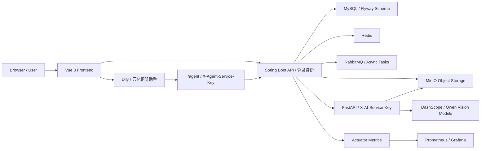

# Cloud Album

Cloud Album 是一个面向个人影像管理的智能云相册系统，由 Vue 前端、Spring Boot 后端、FastAPI AI 服务和 Dify 工作流组成。当前交付范围是个人版；企业组织、多租户、角色权限和多人协作暂不实施。多个测试账号用于校验数据隔离。

文档与仓库代码核对日期：2026-10-02。本页描述当前实现和启动方式，不代表本轮重新通过了在线验收。完整文档目录、历史报告和验收边界见[文档索引](docs/README.md)。

系统支持图片与视频上传、相册整理、分享链接、回收站、多维度浏览、相似图片检索、AI 标签识别、人脸分析，以及面向 Dify 等工作流平台的“云忆相册助手”智能体能力。智能体可以在受控接口下完成图库检索、健康度分析、标签建议、相册整理和待确认写操作，让相册从“存储工具”扩展为“可对话整理的个人影像库”。

## 功能亮点

- 影像管理：支持图片和视频上传、预览、下载、删除、回收站恢复与彻底删除。
- 相册组织：支持普通相册，以及按人物、地点、设备、标签等维度浏览媒体内容。
- 分享能力：支持生成分享链接、保存分享内容、复制分享地址。
- AI 视觉能力：通过独立 AI 服务完成图片标签识别、图片特征提取、人脸检测、人脸特征分析和相似图片检索。
- 智能体扩展：提供 `/agent` 聚合接口，支持能力边界查询、照片检索、组合搜索、图库健康度分析、相似文件发现、聊天附件以图搜图、AI 标签建议任务和相册/标签整理操作。
- 待确认写操作：相册、标签、回收站等整理动作采用“预览 -> 确认 -> 执行”，凭证绑定用户、会话和冻结参数，支持状态查询、取消和防重复执行。附件保存是单独入口，只有明确要求保存时才调用。
- 助手界面：嵌入 Dify WebApp，附件上传和历史会话由 Dify 提供；前端另有活动面板，展示待确认操作、AI 标签批次和相似发现任务。
- 异步任务治理：支持任务重试、死信处理、历史任务补偿扫描、执行次数统计和可选 RabbitMQ 分发。
- 数据可视化：提供文件、地点、标签等维度的数据统计展示。
- 可观测性：集成 Spring Boot Actuator，并提供 Prometheus、Alertmanager、Grafana 的本地观测配置。
- 评测工具：提供统一 JSONL 测评工具，覆盖以图搜图、人脸聚类、智能体工具调用、权限与确认流程、异步任务可靠性等指标。
- 一键启动：根目录提供 `start-apps.cmd`，用于 Windows 本地开发时同时启动后端、前端和 AI 服务。

## 技术栈

| 模块 | 技术 |
| --- | --- |
| 前端 | Vue 3, Vite, TypeScript, Element Plus, ECharts |
| 后端 | Java 17, Spring Boot 3.4, MyBatis-Plus, Sa-Token, Flyway, RabbitMQ, Resilience4j |
| AI 服务 | Python, FastAPI, Uvicorn, DashScope / 阿里云百炼, MinIO SDK |
| 智能体 | Dify Workflow, OpenAPI 工具调用, 预览确认式写操作 |
| 基础设施 | MySQL, Redis, MinIO, RabbitMQ |
| 可观测性 | Spring Boot Actuator, Prometheus, Alertmanager, Grafana |
| 评测 | Python 标准库, JSONL, Markdown / JSON 报告 |

## 系统架构


```mermaid
flowchart LR
    User["Browser / User"] --> Frontend["Vue 3 Frontend"]
    Frontend --> Backend["Spring Boot API / 登录身份"]
    Frontend --> Agent["Dify / 云忆相册助手"]
    Agent --> AgentAPI["/agent / X-Agent-Service-Key"]
    AgentAPI --> Backend
    Backend --> MySQL["MySQL / Flyway Schema"]
    Backend --> Redis["Redis"]
    Backend --> MinIO["MinIO Object Storage"]
    Backend --> MQ["RabbitMQ / Async Tasks"]
    Backend --> AI["FastAPI / X-AI-Service-Key"]
    AI --> MinIO
    AI --> DashScope["DashScope / Qwen Vision Models"]
    Backend --> Metrics["Actuator Metrics"]
    Metrics --> Prometheus["Prometheus / Grafana"]
```

## 项目结构

```text
Cloud-Album/
├─ ai-service/          # Python FastAPI AI 推理服务
├─ backend/             # Spring Boot 后端服务
├─ frontend/            # Vue 前端应用
├─ docs/                # Dify / 智能体工作流与接口文档
├─ evaluation/          # 统一测评工具、样例数据集和报告样例
├─ ops/agent/           # 个人版 Dify 本地网络覆盖配置
├─ ops/observability/   # Prometheus、Alertmanager、Grafana 本地配置
├─ scripts/             # 辅助脚本
├─ .env.example         # 环境变量示例
├─ start-apps.cmd       # Windows 一键启动三端脚本
└─ README.md
```

## 环境要求

- JDK 17（与仓库 CI 一致）
- Maven 3.8+
- Node.js 22（与仓库 CI 一致，包含前端测试工具依赖）
- Python 3.12（与仓库 CI 和 AI Dockerfile 一致）
- MySQL 8+
- Redis
- MinIO
- RabbitMQ（启用 MQ 分发时使用，`ASYNC_TASK_MQ_ENABLED` 默认 `false`）
- 阿里云百炼 DashScope API Key
- 高德地图 Web 服务 API Key（用于反向地理编码）
- 可发送 SMTP 邮件的邮箱授权码

## 环境变量

参考根目录 [.env.example](.env.example) 创建根目录 `.env`；已有 `.env` 时只补齐缺失配置，不覆盖现有值。示例中的空密钥需要填入实际配置，不能直接作为可运行配置。

当前配置读取规则：

- 后端通过 `spring.config.import` 读取工作目录的 `../.env` 和 `./.env`，从仓库根目录或 `backend` 启动均可。使用其它工作目录时需显式提供配置或环境变量。
- AI 按源码位置读取根目录 `.env`，再读取可选的 `ai-service/.env`；后者同名配置覆盖前者。进程环境变量优先于文件。
- 前端 Vite 的 `envDir` 指向仓库根目录，读取根目录 `.env` 和对应模式的环境文件；默认不读取 `frontend/.env`。仅 `VITE_` 前缀的变量暴露给浏览器。
- 共用 `.env` 使用简单的 `NAME=value` 格式。服务密钥使用至少 32 字符的独立随机字符串，避免引号和反斜杠导致 Spring properties 与 Python dotenv 解析不一致。不要为密钥添加 `VITE_` 前缀。

`AGENT_SERVICE_KEY` 用于 Dify → 后端，绑定 `AGENT_OWNER_USER_ID` 指定的个人图库；`AI_SERVICE_KEY` 用于后端 → AI，必须在两端一致。旧的 `AGENT_AUTH_ENABLED`、`AGENT_DEV_USER_ID` 已不再控制访问。`scripts/start-agent-test-services.ps1` 也读取共用 `.env`，不再注入 `tmp/agent-local-runtime.json`。

后端关键变量：

```env
BACKEND_PORT=8088

DB_URL=jdbc:mysql://localhost:3306/memory_space
DB_USERNAME=root
DB_PASSWORD=

REDIS_HOST=localhost
REDIS_PORT=6379
REDIS_PASSWORD=
REDIS_DATABASE=0

RABBITMQ_HOST=localhost
RABBITMQ_PORT=5672
RABBITMQ_USERNAME=
RABBITMQ_PASSWORD=
RABBITMQ_VIRTUAL_HOST=/

MAIL_HOST=smtp.qq.com
MAIL_PORT=465
MAIL_USERNAME=
MAIL_PASSWORD=
MAIL_CODE_TTL_SECONDS=300

SA_TOKEN_JWT_SECRET=

MINIO_URL=http://127.0.0.1:9000
MINIO_ENDPOINT=127.0.0.1:9000
MINIO_ACCESS_KEY=
MINIO_SECRET_KEY=
MINIO_BUCKET=pictures
MINIO_SECURE=false

AMAP_API_KEY=
AMAP_GEO_URL=https://restapi.amap.com/v3/geocode/regeo

AI_SERVICE_URL=http://localhost:5000

MANAGEMENT_ADDRESS=127.0.0.1
MANAGEMENT_PORT=8089
ASYNC_TASK_ADMIN_USER_IDS=
ASYNC_TASK_FACE_RECOVERY_ENABLED=true
ASYNC_TASK_VIDEO_RECOVERY_ENABLED=true
ASYNC_TASK_GEO_RECOVERY_ENABLED=true
ASYNC_TASK_TAG_RECOVERY_ENABLED=false

AI_FEATURE_PROVIDER=aliyun
AI_FEATURE_MODEL=qwen3-vl-embedding
AI_FEATURE_VERSION=v1
AI_FACE_DETECT_PROVIDER=aliyun-qwen-vl-face-detect
AI_TAG_RUNNING_TIMEOUT_SECONDS=180
FACE_CLUSTER_COSINE_THRESHOLD=0.68

AGENT_SERVICE_KEY=
AGENT_OWNER_USER_ID=0
AI_SERVICE_KEY=
AGENT_PUBLIC_WEB_URL=http://localhost:8080
AGENT_PUBLIC_API_URL=http://localhost:8080/devApi
AGENT_PENDING_ACTION_TTL_SECONDS=300
AGENT_WORKFLOW_VERSION=1.6.0
AGENT_PENDING_ACTION_EXECUTION_LEASE_SECONDS=120
AGENT_PENDING_ACTION_CLEANUP_DELAY_MS=60000
AGENT_PENDING_ACTION_CLEANUP_INITIAL_DELAY_MS=60000
```

AI 服务关键变量：

```env
AI_SERVICE_HOST=127.0.0.1
AI_SERVICE_PORT=5000
AI_SERVICE_DEBUG=false
AI_DAILY_MODEL_CALL_LIMIT=500
AI_DECODE_MAX_PIXELS=40000000
DASHSCOPE_API_KEY=
DASHSCOPE_COMPATIBLE_URL=https://dashscope.aliyuncs.com/compatible-mode/v1
DASHSCOPE_MULTIMODAL_EMBEDDING_URL=https://dashscope.aliyuncs.com/api/v1/services/embeddings/multimodal-embedding/multimodal-embedding
VISION_MODEL=qwen3-vl-flash
EMBEDDING_MODEL=qwen3-vl-embedding
AI_REQUEST_TIMEOUT_SECONDS=60
AI_TOP_TAGS=8
AI_IMAGE_MAX_EDGE=1280
AI_IMAGE_MAX_PIXELS=1200000
AI_IMAGE_JPEG_QUALITY=82
AI_FACE_MAX_FACES=10
AI_FACE_MIN_CONFIDENCE=0.25
AI_FACE_CROP_EXPAND_RATIO=0.18
```

前端变量：

```env
VITE_BACKEND_API=/devApi
VITE_DIFY_AGENT_URL=
```

`AGENT_OWNER_USER_ID=0` 是未配置占位值；Dify 服务凭据模式需填写实际图库主人的用户 ID。`VITE_DIFY_AGENT_URL` 填已发布的 Dify WebApp 地址，前端会把 `/chatbot/<标识>` 转为带历史会话的 `/chat/<标识>`。已有浏览器本地保存的助手地址优先于环境变量。旧的 `VITE_AI_API` 不再使用；当前 Vite 已移除 `/mockApi` 到 AI 的代理，浏览器不直接携带 AI 服务密钥。

Windows PowerShell 临时设置示例：

```powershell
$env:DB_PASSWORD="your-db-password"
$env:REDIS_PASSWORD="your-redis-password"
$env:SA_TOKEN_JWT_SECRET="your-long-random-secret"
$env:MINIO_ACCESS_KEY="your-minio-access-key"
$env:MINIO_SECRET_KEY="your-minio-secret-key"
$env:AMAP_API_KEY="your-amap-key"
$env:DASHSCOPE_API_KEY="your-dashscope-key"
```

macOS / Linux 临时设置示例：

```bash
export DB_PASSWORD="your-db-password"
export REDIS_PASSWORD="your-redis-password"
export SA_TOKEN_JWT_SECRET="your-long-random-secret"
export MINIO_ACCESS_KEY="your-minio-access-key"
export MINIO_SECRET_KEY="your-minio-secret-key"
export AMAP_API_KEY="your-amap-key"
export DASHSCOPE_API_KEY="your-dashscope-key"
```

## 数据库初始化

后端使用 Flyway 管理数据库结构。首次启动前创建数据库：

```sql
CREATE DATABASE memory_space DEFAULT CHARACTER SET utf8mb4 COLLATE utf8mb4_unicode_ci;
```

迁移文件位于：

```text
backend/src/main/resources/db/migration/
```

当前迁移从 V0 到 V12。空数据库由 Flyway 顺序初始化；已有数据库遵循原迁移历史，不手动重跑 SQL 或修改已执行脚本。

| 迁移 | 内容 |
| --- | --- |
| V0～V5 | 基础表、异步任务、性能索引、文件状态与对账、outbox、执行次数 |
| V6～V8 | 待确认操作、智能体查询索引、AI 标签批次 |
| V9 | 待确认操作的会话绑定、`agent_conversation` 表 |
| V10 | 分享和下载资源授权 `agent_resource_grant` 表 |
| V11 | 对象回收队列 `file_object_gc` 表 |
| V12 | 后台相似发现任务 `agent_discovery_job` 表 |

V9 之前的预览没有可信会话绑定，需要重新预览。当前 Flyway 配置允许对无历史的非空库按 V0 建立基线，这要求原有基础表已经与 V0 兼容；不能用基线掩盖缺表或不同的表结构。已有数据的容量校准与分片上传配置见[配额说明](backend/docs/quota-migration.md)。本轮文档核对没有执行迁移。

## 启动基础服务

先准备 MySQL、Redis、MinIO；启用 MQ 分发时再配置 RabbitMQ。账号、密码、bucket 与环境变量需一致。容器之间的连接地址与宿主机地址不同，按实际运行位置配置。

MinIO 默认 bucket：

```text
pictures
```

MySQL 默认数据库：

```text
memory_space
```

RabbitMQ 用于异步任务分发。需要启用 MQ 分发时配置 RabbitMQ 连接信息，并设置：

```env
ASYNC_TASK_MQ_ENABLED=true
```

## 一键启动三端

Windows 本地开发可以使用根目录脚本：

```powershell
.\start-apps.cmd
```

它会分别打开三个命令行窗口并启动：

- 后端：`backend`，默认 `http://localhost:8088`
- 前端：`frontend`，默认 `http://localhost:8080`
- AI 服务：`ai-service`，默认 `http://localhost:5000`

如果项目目录、Maven、Node.js 或 Python 虚拟环境路径不同，先按本机路径调整 `start-apps.cmd` 中的启动命令。

该脚本包含本机绝对路径，不处理端口冲突，也不证明服务已启动成功。下文的手动启动命令更适合排查问题。另一个 `scripts/start-agent-test-services.ps1` 用于本地联调：后端运行已打包 JAR，并关闭后台维护、文件清理、对象回收、对账和 MQ 分发；它与正常 `mvn spring-boot:run` 的运行选项不同，不能混作相同环境。

## 手动启动后端

```bash
cd backend
mvn spring-boot:run
```

后端默认地址：

```text
http://localhost:8088
```

Swagger UI：

```text
http://localhost:8088/swagger-ui.html
```

Actuator 健康检查和 Prometheus 指标默认监听本机管理端口：

```text
http://127.0.0.1:8089/actuator/health
http://127.0.0.1:8089/actuator/prometheus
```

## 手动启动 AI 服务

```bash
cd ai-service
pip install -r requirements.txt
python run.py
```

开发环境也可以直接运行：

```bash
uvicorn app.main:app --host 127.0.0.1 --port 5000
```

AI 服务默认地址：

```text
http://localhost:5000
```

匿名健康检查：

```text
http://127.0.0.1:5000/health
```

`/health` 之外的 AI HTTP 路由均校验 `X-AI-Service-Key`，包括 `/docs` 和 `/openapi.json`；直接在浏览器打开文档会被拒绝。模型接口由后端使用同一份 `AI_SERVICE_KEY` 调用。缺少或不足 32 字符的密钥会阻止 AI 服务启动。健康检查不等于实际模型推理成功。

主要接口：

- `POST /recognize`
- `POST /recognize_from_minio`
- `POST /extract_feature`
- `POST /face_analyze`
- `POST /face_feature`

## 手动启动前端

```bash
cd frontend
npm ci
npm run dev
```

前端默认地址：

```text
http://localhost:8080
```

开发环境仅将 `/devApi` 代理到 `http://127.0.0.1:8088`。Vite 监听 `127.0.0.1:8080` 且启用 `strictPort`，端口占用时直接报错，不会自动切换到 8081。若自行更改前端端口，需要同步后端 `CORS_ALLOWED_ORIGINS`，并按需修改代理目标。

构建前端：

```bash
cd frontend
npm run build
```

该命令同时进行类型检查和生产构建。构建产物位于：

```text
frontend/dist/
```

## 智能体能力

智能体后端门面位于：

```text
backend/src/main/java/com/memory/xzp/controller/AgentController.java
```

核心能力包括：

- `GET /agent/capabilities`：查询当前智能体工具能力边界。
- `POST /agent/searchFiles`：按类型、地点、相册、标签或关键词检索照片。
- `POST /agent/advancedSearchFiles`：按日期、多标签、地点层级、设备、相册、人物、媒体类型和数据完整性组合检索。
- `POST /agent/analyzeLibrary`：分析图库健康度，返回未标签、缺少元数据、相似文件、异常 AI 任务等整理建议。
- `POST /agent/discoverSimilarFiles`：发现相似文件。
- `POST /agent/uploadAttachment`：明确授权保存附件；`POST /agent/searchByAttachment`：附件仅用于以图搜图，不自动保存。
- `POST /agent/previewImageTagTask` 与 `POST /agent/submitImageTagTask`：预览并提交 AI 标签建议任务。
- `POST /agent/getAgentTaskStatus`：查询智能体 AI 任务状态。
- `POST /agent/previewApplySuggestedTags` 与 `POST /agent/executeApplySuggestedTags`：预览并应用 AI 标签建议。
- `POST /agent/previewAlbumAction` 与 `POST /agent/executeAlbumAction`：预览并执行相册整理动作。
- `POST /agent/previewTagAction` 与 `POST /agent/executeTagAction`：预览并执行标签整理动作。
- `POST /agent/getPendingActionStatus` 与 `POST /agent/cancelPendingAction`：查询或取消待确认操作。
- `GET /agent/discoveryJobs`、`GET /agent/discoveryJobs/{id}`、`POST /agent/discoveryJobs/{id}/cancel`：查询和取消后台相似发现任务。

除公开的 `/agent/capabilities` 外，智能体接口需要登录身份，或有效的 `X-Agent-Service-Key` 与绑定主人。工作流工具将 `sys.conversation_id` 作为 `conversationId` 传输，不能让模型编造会话 ID。确认操作仅适用于生成该预览的用户和会话。Dify WebApp 的访问者共享服务凭据绑定的图库，不能把个人版应用当作多用户身份隔离入口公开使用。

相似发现结果是候选组，不是自动删除依据。回收站恢复已有预览/确认链路；自然语言删除相册图片先进入可恢复的回收站流程。完整 P3/P4 实际操作、永久删除和清空回收站验收仍属于延期范围。

附件目前每条消息处理一张图片，可以发送「查找和这张图相似度最高的图片」；保存必须明确表达。附件按钮和历史菜单是否可见还取决于 Dify 已发布应用的文件上传配置与 WebApp 页面。具体导入步骤见[个人版 Dify 导入说明](docs/dify-personal-import-2026-09-14.md)。

相关文档位于：

```text
docs/dify-agent-openapi.yaml
docs/dify-agent-system-prompt.md
docs/dify-agent-write-workflow-guide.md
docs/云忆助手功能.md
```

## 异步任务运维接口

全局任务运维接口要求登录且用户 ID 位于 `ASYNC_TASK_ADMIN_USER_IDS`，允许按状态、任务类型、用户和文件检索任务，并支持失败任务重试、死信取消、补偿扫描开关和立即补偿。个人版 Dify 服务密钥不替代这些运维接口的管理员校验。

主要接口：

- `GET /asyncTask/admin/list`
- `POST /asyncTask/admin/retry`
- `POST /asyncTask/admin/dead/cancel`
- `GET /asyncTask/admin/recovery`
- `POST /asyncTask/admin/recovery/{taskType}/enabled`
- `POST /asyncTask/admin/recovery/{taskType}/run`

## 评测工具

统一测评工具位于：

```text
evaluation/
```

以下是读取样例数据生成报告的命令，不会证明真实业务已通过；示例输出写入临时目录，保留仓库报告：

```powershell
python evaluation/run.py evaluate `
  --manifest evaluation/manifest.example.json `
  --output-dir tmp/evaluation-example
```

测评输出包括：

- `report.json`：机器可读报告。
- `report.md`：中文可读报告。

覆盖的评测方向：

- 以图搜图：Recall@K、Hit@K、P95、错误率。
- 人脸聚类：Pairwise Precision、Pairwise Recall、Pairwise F1、错误合并率、人工修正率。
- 智能体：工具选择准确率、参数抽取准确率、任务完成率、验证覆盖率；实际业务完成还需匹配独立的业务状态证据，不能只凭对话或 HTTP 成功判定。
- 权限与确认流程：越权访问、确认绕过、参数篡改和副作用验证。
- 异步任务：最终成功率、重复执行数、重复业务副作用数、恢复耗时。

更多采集与指标说明见：

```text
evaluation/README.md
```

## 可观测性

项目提供 Prometheus、Alertmanager 和 Grafana 的本地编排配置，以及异步任务可靠性告警和 Grafana 面板。

启动监控服务：

```bash
cd ops/observability
docker compose up -d
```

访问地址：

- Prometheus：`http://localhost:9090`
- Alertmanager：`http://localhost:9093`
- Grafana：`http://localhost:3000`

Grafana 默认账号密码为 `admin` / `admin`。后端管理端口默认只监听 `127.0.0.1`，容器内 Prometheus 的 `host.docker.internal:8089` 不一定能访问它，需要按本机网络配置解决可达性。默认空接收器不发送通知；端口、凭据、阈值和通知路由见[可观测性说明](ops/observability/README.md)。

## 常见问题

### 后端启动时提示 `Could not resolve placeholder`

说明必填配置没有被当前进程读取到。检查根目录 `.env`、当前工作目录和终端/IDE 的环境变量；修改后重启对应服务。运行旧 JAR 时，需先重新打包才能包含新的配置加载逻辑。

### 8088 或 5000 端口被占用

检查监听进程是否已经是本项目服务，按需关闭对应旧实例，再由同一入口启动；不要反复启动多个副本。`start-apps.cmd` 本身没有防重复启动逻辑。

### 登录返回 `403 Invalid CORS request`

核对浏览器实际来源的协议、域名和端口，以及后端 `CORS_ALLOWED_ORIGINS`。默认包含 8080，不包含 8081。不要通过放开全部来源绕过配置问题。

### 附件提示「处理未确认成功」或 Dify 工具请求失败

依次定位 Dify 工具、后端入口、后端调用 AI 三处日志。Dify → 后端使用 `X-Agent-Service-Key`；后端 → AI 使用另一个 `X-AI-Service-Key`。两段密钥用途不同。AI 返回 401 时应核对两端生效的 `AI_SERVICE_KEY`，尤其是终端环境变量或 `ai-service/.env` 的覆盖。修正后重启后端与 AI。

Dify 的 SSRF/重试错误文字不能单独证明是网络拦截，应同时查看实际 HTTP 状态和后端日志。查询可重试；保存失败先查图库，避免重复保存。2026-09-15 的日志和修复过程保留在[附件修复记录](docs/agent-restore-ui-fix-2026-09-15.md)，该记录不表示当前环境已在线验收。

### 登录时提示 Redis `NOAUTH Authentication required`

Redis 开启了密码认证，但后端没有读取到 `REDIS_PASSWORD`。配置示例：

```env
REDIS_PASSWORD=your-redis-password
```

### AI 模型调用提示 `DASHSCOPE_API_KEY environment variable is not configured`

配置 DashScope API Key：

```env
DASHSCOPE_API_KEY=your-dashscope-key
```

### MinIO 文件无法访问

检查 MinIO 服务地址、访问密钥、bucket 名称以及后端/AI 服务中的 MinIO 配置是否一致。
