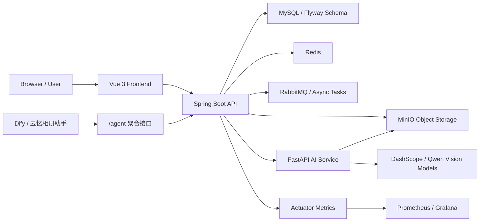

# Cloud Album

Cloud Album 是一个面向个人与家庭影像资产管理的智能云相册系统。项目由 Vue 前端、Spring Boot 后端和 FastAPI AI 服务组成，围绕照片/视频管理、对象存储、异步任务、AI 视觉分析和智能体协作构建完整的全栈应用。

系统支持图片与视频上传、相册整理、分享链接、回收站、多维度浏览、相似图片检索、AI 标签识别、人脸分析，以及面向 Dify 等工作流平台的“云忆相册助手”智能体能力。智能体可以在受控接口下完成图库检索、健康度分析、标签建议、相册整理和待确认写操作，让相册从“存储工具”扩展为“可对话整理的个人影像库”。

## 功能亮点

- 影像管理：支持图片和视频上传、预览、下载、删除、回收站恢复与彻底删除。
- 相册组织：支持普通相册，以及按人物、地点、设备、标签等维度浏览媒体内容。
- 分享能力：支持生成分享链接、保存分享内容、复制分享地址。
- AI 视觉能力：通过独立 AI 服务完成图片标签识别、图片特征提取、人脸检测、人脸特征分析和相似图片检索。
- 智能体扩展：提供 `/agent` 聚合接口，支持能力边界查询、照片检索、组合搜索、图库健康度分析、相似文件发现、聊天附件以图搜图、AI 标签建议任务和相册/标签整理操作。
- 待确认写操作：智能体写入类动作采用“预览 -> 确认 -> 执行”的流程，支持一次性确认凭证、幂等执行、状态查询和取消。
- 异步任务治理：支持任务重试、死信处理、历史任务补偿扫描、执行次数统计和可选 RabbitMQ 分发。
- 数据可视化：提供文件、地点、标签等维度的数据统计展示。
- 可观测性：集成 Spring Boot Actuator，并提供 Prometheus、Alertmanager、Grafana 的本地观测配置。
- 评测工具：提供统一 JSONL 测评工具，覆盖以图搜图、人脸聚类、智能体工具调用、权限与确认流程、异步任务可靠性等指标。
- 一键启动：根目录提供 `start-apps.cmd`，用于 Windows 本地开发时同时启动后端、前端和 AI 服务。

## 技术栈

| 模块 | 技术 |
| --- | --- |
| 前端 | Vue 3, Vite, TypeScript, Element Plus, ECharts |
| 后端 | Java 17, Spring Boot 3.4, MyBatis-Plus, Sa-Token, Flyway, RabbitMQ, Resilience4j |
| AI 服务 | Python, FastAPI, Uvicorn, DashScope / 阿里云百炼, MinIO SDK |
| 智能体 | Dify Workflow, OpenAPI 工具调用, 预览确认式写操作 |
| 基础设施 | MySQL, Redis, MinIO, RabbitMQ |
| 可观测性 | Spring Boot Actuator, Prometheus, Alertmanager, Grafana |
| 评测 | Python 标准库, JSONL, Markdown / JSON 报告 |

## 系统架构


```mermaid
flowchart LR
    User["Browser / User"] --> Frontend["Vue 3 Frontend"]
    Frontend --> Backend["Spring Boot API"]
    Agent["Dify / 云忆相册助手"] --> AgentAPI["/agent 聚合接口"]
    AgentAPI --> Backend
    Backend --> MySQL["MySQL / Flyway Schema"]
    Backend --> Redis["Redis"]
    Backend --> MinIO["MinIO Object Storage"]
    Backend --> MQ["RabbitMQ / Async Tasks"]
    Backend --> AI["FastAPI AI Service"]
    AI --> MinIO
    AI --> DashScope["DashScope / Qwen Vision Models"]
    Backend --> Metrics["Actuator Metrics"]
    Metrics --> Prometheus["Prometheus / Grafana"]
```

## 项目结构

```text
Cloud-Album/
├─ ai-service/          # Python FastAPI AI 推理服务
├─ backend/             # Spring Boot 后端服务
├─ frontend/            # Vue 前端应用
├─ docs/                # Dify / 智能体工作流与接口文档
├─ evaluation/          # 统一测评工具、样例数据集和报告样例
├─ ops/observability/   # Prometheus、Alertmanager、Grafana 本地配置
├─ scripts/             # 辅助脚本
├─ .env.example         # 环境变量示例
├─ start-apps.cmd       # Windows 一键启动三端脚本
└─ README.md
```

## 环境要求

- JDK 17+
- Maven 3.8+
- Node.js 18+（建议 20+）
- Python 3.10+
- MySQL 8+
- Redis
- MinIO
- RabbitMQ
- 阿里云百炼 DashScope API Key
- 高德地图 Web 服务 API Key（用于反向地理编码）
- 可发送 SMTP 邮件的邮箱授权码

## 环境变量

参考根目录 `.env.example` 配置本地或服务器环境变量。

后端关键变量：

```env
BACKEND_PORT=8088

DB_URL=jdbc:mysql://localhost:3306/memory_space
DB_USERNAME=root
DB_PASSWORD=

REDIS_HOST=localhost
REDIS_PORT=6379
REDIS_PASSWORD=
REDIS_DATABASE=0

RABBITMQ_HOST=localhost
RABBITMQ_PORT=5672
RABBITMQ_USERNAME=
RABBITMQ_PASSWORD=
RABBITMQ_VIRTUAL_HOST=/

MAIL_HOST=smtp.qq.com
MAIL_PORT=465
MAIL_USERNAME=
MAIL_PASSWORD=
MAIL_CODE_TTL_SECONDS=300

SA_TOKEN_JWT_SECRET=

MINIO_URL=http://127.0.0.1:9000
MINIO_ENDPOINT=127.0.0.1:9000
MINIO_ACCESS_KEY=
MINIO_SECRET_KEY=
MINIO_BUCKET=pictures
MINIO_SECURE=false

AMAP_API_KEY=
AMAP_GEO_URL=https://restapi.amap.com/v3/geocode/regeo

AI_SERVICE_URL=http://localhost:5000

MANAGEMENT_ADDRESS=127.0.0.1
MANAGEMENT_PORT=8089
ASYNC_TASK_ADMIN_USER_IDS=
ASYNC_TASK_FACE_RECOVERY_ENABLED=true
ASYNC_TASK_VIDEO_RECOVERY_ENABLED=true
ASYNC_TASK_GEO_RECOVERY_ENABLED=true
ASYNC_TASK_TAG_RECOVERY_ENABLED=false

AI_FEATURE_PROVIDER=aliyun
AI_FEATURE_MODEL=qwen3-vl-embedding
AI_FEATURE_VERSION=v1
AI_FACE_DETECT_PROVIDER=aliyun-qwen-vl-face-detect
AI_TAG_RUNNING_TIMEOUT_SECONDS=180
FACE_CLUSTER_COSINE_THRESHOLD=0.68

AGENT_AUTH_ENABLED=false
AGENT_DEV_USER_ID=1
AGENT_PENDING_ACTION_TTL_SECONDS=300
AGENT_WORKFLOW_VERSION=1.6.0
AGENT_PENDING_ACTION_EXECUTION_LEASE_SECONDS=120
AGENT_PENDING_ACTION_CLEANUP_DELAY_MS=60000
AGENT_PENDING_ACTION_CLEANUP_INITIAL_DELAY_MS=60000
```

AI 服务关键变量：

```env
AI_SERVICE_HOST=0.0.0.0
AI_SERVICE_PORT=5000
AI_SERVICE_DEBUG=false
DASHSCOPE_API_KEY=
DASHSCOPE_COMPATIBLE_URL=https://dashscope.aliyuncs.com/compatible-mode/v1
DASHSCOPE_MULTIMODAL_EMBEDDING_URL=https://dashscope.aliyuncs.com/api/v1/services/embeddings/multimodal-embedding/multimodal-embedding
VISION_MODEL=qwen3-vl-flash
EMBEDDING_MODEL=qwen3-vl-embedding
AI_REQUEST_TIMEOUT_SECONDS=60
AI_TOP_TAGS=8
AI_IMAGE_MAX_EDGE=1280
AI_IMAGE_MAX_PIXELS=1200000
AI_IMAGE_JPEG_QUALITY=82
AI_FACE_MAX_FACES=10
AI_FACE_MIN_CONFIDENCE=0.25
AI_FACE_CROP_EXPAND_RATIO=0.18
```

前端变量：

```env
VITE_BACKEND_API=/devApi
VITE_AI_API=/mockApi
VITE_DIFY_AGENT_URL=
```

Windows PowerShell 临时设置示例：

```powershell
$env:DB_PASSWORD="your-db-password"
$env:REDIS_PASSWORD="your-redis-password"
$env:SA_TOKEN_JWT_SECRET="your-long-random-secret"
$env:MINIO_ACCESS_KEY="your-minio-access-key"
$env:MINIO_SECRET_KEY="your-minio-secret-key"
$env:AMAP_API_KEY="your-amap-key"
$env:DASHSCOPE_API_KEY="your-dashscope-key"
```

macOS / Linux 临时设置示例：

```bash
export DB_PASSWORD="your-db-password"
export REDIS_PASSWORD="your-redis-password"
export SA_TOKEN_JWT_SECRET="your-long-random-secret"
export MINIO_ACCESS_KEY="your-minio-access-key"
export MINIO_SECRET_KEY="your-minio-secret-key"
export AMAP_API_KEY="your-amap-key"
export DASHSCOPE_API_KEY="your-dashscope-key"
```

## 数据库初始化

后端使用 Flyway 管理数据库结构。首次启动前创建数据库：

```sql
CREATE DATABASE memory_space DEFAULT CHARACTER SET utf8mb4 COLLATE utf8mb4_unicode_ci;
```

迁移文件位于：

```text
backend/src/main/resources/db/migration/
```

其中 `V0__init_schema.sql` 提供完整基础表结构，后续 `V5`、`V6`、`V7`、`V8` 等迁移会补充异步任务执行次数、智能体待确认操作、智能体查询索引和 AI 标签批次表。

## 启动基础服务

先启动 MySQL、Redis、MinIO 和 RabbitMQ，并保持账号、密码、bucket 与环境变量一致。

MinIO 默认 bucket：

```text
pictures
```

MySQL 默认数据库：

```text
memory_space
```

RabbitMQ 用于异步任务分发。需要启用 MQ 分发时配置 RabbitMQ 连接信息，并设置：

```env
ASYNC_TASK_MQ_ENABLED=true
```

## 一键启动三端

Windows 本地开发可以使用根目录脚本：

```powershell
start-apps.cmd
```

它会分别打开三个命令行窗口并启动：

- 后端：`backend`，默认 `http://localhost:8088`
- 前端：`frontend`，默认 `http://localhost:8080`
- AI 服务：`ai-service`，默认 `http://localhost:5000`

如果项目目录、Maven、Node.js 或 Python 虚拟环境路径不同，先按本机路径调整 `start-apps.cmd` 中的启动命令。

## 手动启动后端

```bash
cd backend
mvn spring-boot:run
```

后端默认地址：

```text
http://localhost:8088
```

Swagger UI：

```text
http://localhost:8088/swagger-ui.html
```

Actuator 健康检查和 Prometheus 指标默认监听本机管理端口：

```text
http://127.0.0.1:8089/actuator/health
http://127.0.0.1:8089/actuator/prometheus
```

## 手动启动 AI 服务

```bash
cd ai-service
pip install -r requirements.txt
python run.py
```

开发环境也可以直接运行：

```bash
uvicorn app.main:app --host 0.0.0.0 --port 5000
```

AI 服务默认地址：

```text
http://localhost:5000
```

接口文档：

```text
http://localhost:5000/docs
```

主要接口：

- `POST /recognize`
- `POST /recognize_from_minio`
- `POST /extract_feature`
- `POST /face_analyze`
- `POST /face_feature`

## 手动启动前端

```bash
cd frontend
npm install
npm run dev
```

前端默认地址：

```text
http://localhost:8080
```

开发环境下，Vite 会代理：

- `/devApi` 到 `http://127.0.0.1:8088`
- `/mockApi` 到 `http://127.0.0.1:5000`

构建前端：

```bash
cd frontend
npm run build
```

构建产物位于：

```text
frontend/dist/
```

## 智能体能力

智能体后端门面位于：

```text
backend/src/main/java/com/memory/xzp/controller/AgentController.java
```

核心能力包括：

- `GET /agent/capabilities`：查询当前智能体工具能力边界。
- `POST /agent/searchFiles`：按类型、地点、相册、标签或关键词检索照片。
- `POST /agent/advancedSearchFiles`：按日期、多标签、地点层级、设备、相册、人物、媒体类型和数据完整性组合检索。
- `POST /agent/analyzeLibrary`：分析图库健康度，返回未标签、缺少元数据、相似文件、异常 AI 任务等整理建议。
- `POST /agent/discoverSimilarFiles`：发现相似文件。
- `POST /agent/uploadAttachment` 与 `POST /agent/searchByAttachment`：支持聊天附件以图搜图。
- `POST /agent/previewImageTagTask` 与 `POST /agent/submitImageTagTask`：预览并提交 AI 标签建议任务。
- `POST /agent/getAgentTaskStatus`：查询智能体 AI 任务状态。
- `POST /agent/previewApplySuggestedTags` 与 `POST /agent/executeApplySuggestedTags`：预览并应用 AI 标签建议。
- `POST /agent/previewAlbumAction` 与 `POST /agent/executeAlbumAction`：预览并执行相册整理动作。
- `POST /agent/previewTagAction` 与 `POST /agent/executeTagAction`：预览并执行标签整理动作。
- `POST /agent/getPendingActionStatus` 与 `POST /agent/cancelPendingAction`：查询或取消待确认操作。

相关文档位于：

```text
docs/dify-agent-openapi.yaml
docs/dify-agent-system-prompt.md
docs/dify-agent-write-workflow-guide.md
docs/云忆助手功能.md
```

## 异步任务运维接口

全局任务运维接口允许按状态、任务类型、用户和文件检索任务，并支持失败任务重试、死信取消、补偿扫描开关和立即补偿。

主要接口：

- `GET /asyncTask/admin/list`
- `POST /asyncTask/admin/retry`
- `POST /asyncTask/admin/dead/cancel`
- `GET /asyncTask/admin/recovery`
- `POST /asyncTask/admin/recovery/{taskType}/enabled`
- `POST /asyncTask/admin/recovery/{taskType}/run`

## 评测工具

统一测评工具位于：

```text
evaluation/
```

先运行示例：

```powershell
python evaluation/run.py evaluate `
  --manifest evaluation/manifest.example.json `
  --output-dir evaluation/reports/example
```

测评输出包括：

- `report.json`：机器可读报告。
- `report.md`：中文可读报告。

覆盖的评测方向：

- 以图搜图：Recall@K、Hit@K、P95、错误率。
- 人脸聚类：Pairwise Precision、Pairwise Recall、Pairwise F1、错误合并率、人工修正率。
- 智能体：工具选择准确率、参数抽取准确率、任务完成率、验证覆盖率。
- 权限与确认流程：越权访问、确认绕过、参数篡改和副作用验证。
- 异步任务：最终成功率、重复执行数、重复业务副作用数、恢复耗时。

更多采集与指标说明见：

```text
evaluation/README.md
```

## 可观测性

项目提供 Prometheus、Alertmanager 和 Grafana 的本地编排配置，以及异步任务可靠性告警和 Grafana 面板。

启动监控服务：

```bash
cd ops/observability
docker compose up -d
```

访问地址：

- Prometheus：`http://localhost:9090`
- Alertmanager：`http://localhost:9093`
- Grafana：`http://localhost:3000`

Grafana 默认账号密码为 `admin` / `admin`。详细阈值和通知路由见 `ops/observability/README.md`。

## 常见问题

### 后端启动时提示 `Could not resolve placeholder`

说明某个必填环境变量没有被当前进程读取到。检查变量名是否配置正确，并重启终端或 IDE。

### 登录时提示 Redis `NOAUTH Authentication required`

Redis 开启了密码认证，但后端没有读取到 `REDIS_PASSWORD`。配置示例：

```env
REDIS_PASSWORD=your-redis-password
```

### AI 服务启动时提示 `DASHSCOPE_API_KEY environment variable is not configured`

配置 DashScope API Key：

```env
DASHSCOPE_API_KEY=your-dashscope-key
```

### MinIO 文件无法访问

检查 MinIO 服务地址、访问密钥、bucket 名称以及后端/AI 服务中的 MinIO 配置是否一致。
