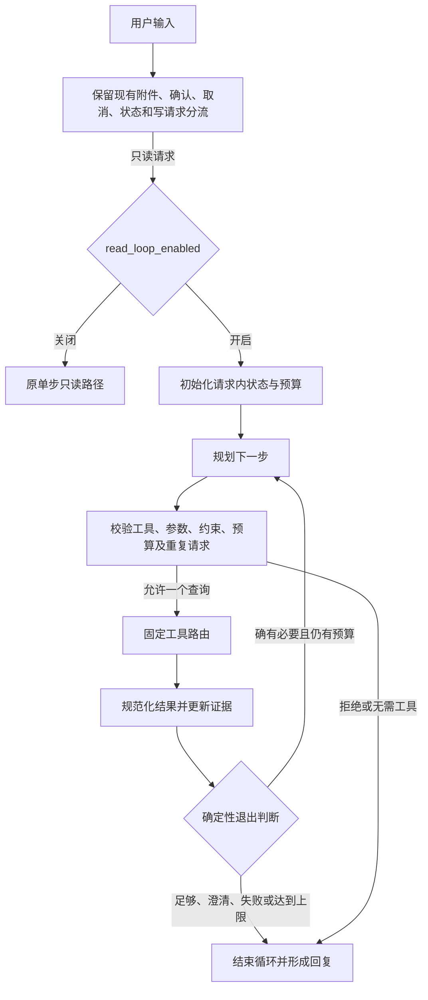

# 个人版 Cloud-Album 受控 Agent 循环实现方案

实施状态（2026-10-04）：第一期 A～C 已交付并按用户确认收尾，冻结快照保留。第二期已实现；用户最新授权代理接管重点在线验证、修复和收尾，覆盖此前不运行测试/模型及不自行导入发布的限制。现已完成重点验证并发布本地 Dify，实际成绩及未测边界见[第二期验收收尾](dify-read-write-phase2-acceptance-2026-10-04.md)。下文启动时的历史范围不覆盖该最新授权。

方案日期：2026-10-02。源码核对基线：`4ccef785`，实施前重新检查实际 HEAD 和工作区差异。本次只分析和写文档，没有实现循环、启动服务、运行测试、导入 Dify 或调用业务模型。

本文件是新对话的实施依据。默认交付第一期查询循环；第二期查询到写预览桥接单独列出，未获明确实施范围前不自动加入。现有确认执行、附件、回收站、资源授权和相似发现实现继续保留。

## 1. 决策与交付目标

采用 **Dify 显式 Loop + 每轮一个规划输出 + 确定性校验 + 固定工具路由**。不整体换成自由调用全部工具的 Agent，不新建后端编排服务，不引入新的数据库表。

第一期要解决：

1. 有依赖关系的连续查询，例如先列出普通相册，再按唯一匹配的相册查询未标签照片。
2. 在相同用户约束内，根据查询反馈选择必要的下一步。
3. 对明确可修正的参数错误最多调整一次；对配置错误立即结束。
4. 工具响应不可信、无结果、部分成功、达到预算时，都能清楚结束并展示已有证据。
5. 普通问题不因增加循环而固定多查几轮。

第一期不包含：循环自动写入、跨消息自动继续、后台长期自主任务、自动更新配置、附件重复上传、批量图像模型调用、完整评测集重建、监控扩展及企业能力。

## 2. 当前实现与改造位置

当前 DSL 有 110 个节点，包含 3 个 LLM 节点、27 个工具节点，未包含 Agent/Loop。现有只读路径为：

```text
现有入口分流和写意图识别
  → extract_keyword（只读规划）
  → validate_read_plan（参数校验）
  → route_read_tool（固定工具分支）
  → read_result（变量汇聚）
  → summarize → answer
```

确认/取消/状态、附件与写预览已经有独立保护。只替换或包裹上述只读路径，循环不得直接连入 `execute*`、`submitImageTagTask`、`uploadAttachment` 或 pending 凭据赋值节点。

`extract_write_action`、`extract_keyword`、`summarize` 分别承担写意图识别、查询规划、结果整理。实际每条路径调用次数以导入后的轨迹为准，不能把“最多三轮查询”报告为“整条消息最多三次模型调用”。

## 3. 工作流结构



图中的回边表示 Loop 容器内执行，不是在普通 DAG 上直接添加任意环。实施时用目标 Dify 版本实际支持的 Loop 序列化格式、循环起点、子节点所属关系、变量更新和退出节点构造 DSL，不照抄猜测的 YAML 字段。

一个实现细节：成功调用工具后，代码先检查显式目标是否满足；已满足直接结束。只有目标还缺少具体证据且已有合法下一步时再进入下一轮。最后一次工具调用后不再增加无预算的“反思”调用。

简单请求在第一次有效结果后结束。复合查询优先使用现有 `advancedSearchFiles` 一次解决；多个过滤维度本身不构成必须循环的理由。

## 4. 第一期工具白名单

| 工具 | 循环用途 | 限制 |
| --- | --- | --- |
| `getAgentCapabilities` | 用户询问能力边界 | 不是每条请求的前置调用，调用后通常结束 |
| `searchFiles` | 简单照片搜索 | 分页、数量和排序按合法参数校验 |
| `advancedSearchFiles` | 多条件照片搜索 | 保留日期、相册、人物、媒体和完整性硬约束 |
| `listAlbums` | 解析普通相册 | 只能从真实结果选择，重名不能自行选一个 |
| `listLocationAlbums` | 查地点相册 | 结果不能当作普通相册 ID 使用 |
| `listModelAlbums` | 查设备相册 | 同上，类别必须匹配 |
| `listTags` | 用户需要标签列表或允许按标签查找 | 标签不是人物分组；不能把语义猜测当确定标签 |
| `listPeople` | 用户指定人物分组时查询该分组 | 不推断真实身份或敏感属性 |
| `analyzeLibrary` | 用户明确要求图库健康/整理建议 | 调用成本可能较高，不作为每次搜索的兜底 |

固定工具分支只读取校验节点输出，不让模型提供 URL、HTTP 方法、凭据或任意 operationId。每个工具原生变量绑定 `conversationId=sys.conversation_id`。

下列入口留在原路径：

- `getPendingActionStatus`、`cancelPendingAction`：确认事务状态，凭据不进入循环。
- `getAgentTaskStatus`：原 AI 标签任务状态分支，不用模型持续轮询。
- `discoverSimilarFiles`：会创建后台任务，虽然不修改照片，也不属于本期纯查询循环。
- 附件搜图/上传、所有 Preview 和 Execute/Submit 工具。

后端已有 `/agent/discoveryJobs` 查询/取消接口，当前并未作为对应 Dify 工具开放。第一期不为循环增加这些工具；进度继续由前端活动面板展示。

不要新增并不存在的 `getFileDetail` 等工具。本期查询能力以现有 OpenAPI 白名单为准。

## 5. 请求内状态与模型输出

### 5.1 状态结构

状态只在当前工作流运行内存在，不写数据库，不覆盖现有 `pending_*` 会话变量。建议 Code 节点使用有版本的 JSON 字符串作为完整状态载体，并为路由暴露少量明确类型的标量；不要依赖未验证的任意深层 Dify 对象赋值。

```json
{
  "schemaVersion": 1,
  "step": 0,
  "toolCalls": 0,
  "repairCount": 0,
  "status": "RUNNING",
  "requiredGoals": ["resolve_album", "find_untagged_photos"],
  "completedGoals": [],
  "lockedConstraints": {},
  "requestSignatures": [],
  "observations": [],
  "stopReason": ""
}
```

字段来源与规则：

- `step/toolCalls/repairCount/status` 由代码更新，模型不能重置计数或伪造终态。
- `requiredGoals` 在首次规划校验后冻结；只能来自当前请求或可靠的只读上下文。支持的目标类型必须枚举，不接受任意“已完成”的文字声明。
- `lockedConstraints` 保存首次校验后的用户约束、来源和是否明确允许调整；后续每轮逐项比较。
- `observations` 记录工具名、有效参数、业务状态、分页、有效条件、记录摘要及错误类别。状态 JSON 有硬大小上限，不能无限累积原始结果。
- 实际照片 ID 留在代码侧证据映射；给模型展示短 `recordRef`、名称和必要属性。模型选出的引用必须能在本次真实结果中解析。
- 请求签名包括工具名及白名单归一化后的参数，稳定排序、统一缺省值；不得将不同语义的三态、标签 AND/OR 或有意义的排序归一成相同值。

### 5.2 每轮规划契约

```json
{
  "decision": "CALL_TOOL",
  "selectedTool": "advancedSearchFiles",
  "parameters": {},
  "goalId": "find_untagged_photos",
  "reasonCode": "NEED_QUERY_RESULT",
  "evidenceRefs": ["observation_1"],
  "question": ""
}
```

`decision` 只允许 `CALL_TOOL / FINISH / CLARIFY`。这些是控制建议，需代码校验后才能生效；`FINISH` 不代表业务完成，代码必须检查是否有成功证据和哪些目标仍未覆盖。

不让模型生成可执行代码、整段工具 HTTP 请求、写动作、确认凭据或长篇隐藏推理。`reasonCode` 是简短枚举，便于审计和控制成本。

校验必须拒绝未知字段、未知工具、错误类型、非有限数字和越界分页。所有工具参数逐项从现有 Schema/DTO 白名单映射，兼容现有数组及三态处理，不用通用字符串拼接请求。

首次输出不合法时，不用额外无上限的 JSON 修复模型：安全结束并澄清。对合法请求的可修复业务参数错误，才在预算内允许一次调整。

### 5.3 状态机

```text
RUNNING → COMPLETED / NO_RESULTS / NEEDS_CLARIFICATION
        → PARTIAL / FAILED / BUDGET_EXCEEDED
```

完成条件由确定性代码实现：

- 已有成功工具证据，预先冻结的目标已满足 → `COMPLETED`。
- 合法查询成功但集合为空 → `NO_RESULTS`，不是调用失败。
- 存在显著歧义、重名、需要放宽硬约束 → `NEEDS_CLARIFICATION`。
- 有已验证结果但后续失败或不足以完成全部目标 → `PARTIAL`。
- 没有可用证据且工具或契约失败 → `FAILED`。
- 规划、调用、大小或时间预算耗尽 → `BUDGET_EXCEEDED`；仍可展示已确认的部分结果。

自然语言目标的抽取可能出错。校验器不能保证理解了全部用户意图；对高影响歧义要澄清，展示真实生效条件，不能把该机制描述成语义正确性的完全证明。

## 6. 保持用户约束

首次规划之后冻结日期字段及范围、普通相册、人物分组、地点、媒体类型、标签及 AND/OR、数据完整性、用户限定数量和排序。模型不得因空结果删除这些条件。

允许的下一步示例：

- 按用户指定名称查询相册列表，再用唯一匹配的真实 ID 查询同一相册。
- 用户明确表示“也可以搜同义标签”时，查询真实标签，再在许可范围内选择；语义不确定先问。
- 用户要求最多看 30 张，第一页不足且 `hasNext=true` 时再取下一页；不能擅自扫描全部图库。
- 后端提供明确错误且有唯一无损修正时调整参数一次。

不允许：

- 将“去年北京的照片”扩大为所有年份或所有地点。
- 将标签 AND 改为 OR、未标签改为全部、有 GPS 改为地点任意。
- 多个同名相册时默认第一个；没有真实结果时编造资源 ID。
- 看见 `relaxSuggestions` 就自动放宽：它们是建议，不是用户授权。

相对日期使用本次运行开始时捕获的参考时间与明确时区（个人版默认 Asia/Shanghai），整个循环保持同一基准。“去年”等规范化为固定日期区间。工作流没有可靠日期上下文或出现语义歧义时，要求明确日期，不让模型凭训练日期猜测。

接口转换需要逐字段对照 `AgentAdvancedSearchRequest`。`AgentAdvancedSearchResultVO` 的 `conditionSummary/records/total/pages/hasNext/relaxSuggestions` 可作为已有证据；旧 `searchFiles` 的分页结果不提供相同的结构化条件证明，不能伪造一份。严格复合条件优先用组合接口。

只读“继续/下一页”的既有行为保留；首次规划可参考既有最近 8 轮只读上下文。当前上下文不足则澄清；循环中的后续规划只接收本次任务摘要与证据，不重复带全部聊天历史。第一期不新增持久化查询记忆或跨轮写目标恢复。

## 7. 工具结果适配与错误策略

结果解析先处理 Dify `text/json` 的实际包装差异，兼容现有单元素数组包装；拒绝多个互相冲突的 envelope。HTTP 2xx、工具节点成功、业务 `code==200` 是不同条件，要分别核对。

对每个白名单工具编写明确适配器，不能把所有返回值假定为同一种 `data.records`。支持照片分页、各类相册分页、标签/人物列表、能力清单和图库分析的实际格式；实施时逐项对照控制器返回模型，不从自然语言回复提取“成功”。

| 结果/错误 | 行为 |
| --- | --- |
| 成功且满足目标 | 直接退出，必要时显示分页和样本限制 |
| 成功、空集合 | 如实展示空结果；没有明确合法替代就结束 |
| 请求参数错误 | 只有唯一无损修正时，最多一次并计入全部预算 |
| 401/403 | 立即结束，提示检查登录或对应服务凭据；不自动修配置 |
| 404 | 区分接口不存在与业务资源不存在；前者结束，后者澄清，不猜资源 |
| 429/配额耗尽 | 结束，提示稍后继续；不在本轮模型驱动重试 |
| 连接失败、超时、5xx | 第一版结束或返回已有部分结果；不重复消耗调用 |
| 非 JSON、结构错误、业务失败 | 拒绝当成成功，记录脱敏错误类别 |
| 同工具同有效参数再次提出 | 不重新调用，复用请求内证据或停止为无进展 |

第一版不配置 Dify 工具节点的隐藏自动重试，以免一个“调用”实际发出多次 HTTP 请求。后续如增加重试，必须同时纳入预算和记录。

照片名称、标签、工具自由文本均视作外部数据，不能覆盖系统指令。展示和模型输入去除服务密钥、确认凭据、对象内部路径、签名 URL、向量和异常堆栈；敏感字段不能进入规划提示词或可见日志。

## 8. 成本和退出预算

配置建议通过 Dify 环境变量或确定性配置节点提供，不能让用户消息/模型输出改变：

| 配置 | 初始值 | 语义 |
| --- | --- | --- |
| `read_loop_enabled` | `false` | 保留原单步路径；人工导入检查后开启 |
| `read_loop_max_steps` | `3` | 当前消息最多三次循环规划，首次也计数 |
| `read_loop_max_tool_calls` | `3` | 当前消息最多三次实际白名单调用 |
| `read_loop_max_repairs` | `1` | 计入上面次数，不是额外免费重试 |
| `read_loop_soft_deadline_seconds` | `90` | 每个步骤开始前检查的运行预算 |
| `read_loop_page_size` | `20` | 默认查询页大小；不能覆盖用户更小上限 |
| `read_loop_max_collected_records` | `60` | 总收集上限；更大范围要求分页交互 |
| `read_loop_max_observation_chars` | `6000` | 全部模型可见证据摘要总字符上限 |
| `read_loop_max_state_bytes` | `32768` | 内部 JSON 状态大小上限，超限停止 |

同名配置无效或超出允许上限时使用安全默认值或拒绝开启，不接受负数/无限大。Loop 容器最大次数和代码计数器同时限制，不只依赖提示词。

单步路径保持现有调用数量；复杂路径最多现有写意图识别一次 + 循环规划三次 + 最终整理一次，即规划目标总上限为五次 LLM 调用。必须在真实轨迹中核对，若还有隐藏 LLM/自动重试需计入或关闭。不另加 LLM 分类器、反思器、每轮总结器。

结果足够清晰时用确定性模板结束，可省去最终整理模型。需要自然语言整理时只用一次现有 `summarize`，依据累积的已验证证据，不能再读取“唯一工具结果”的旧语义。

90 秒是步骤之间的软预算，不能中断已经阻塞的模型/HTTP 调用，也不是严格端到端 SLA。若目标版本支持节点/工作流超时，应配合配置；不支持时明确保留此限制，不为达成超时指标新增编排架构。

字符摘要限制不等于精确 token 或费用限额。先约束输入长度、输出 JSON 长度和调用次数；精确费用取决于模型和计费配置。

AI 服务的每日模型预算主要约束该 AI 服务的模型调用，不覆盖 Dify 自己的文本规划模型。不能把 `AI_DAILY_MODEL_CALL_LIMIT` 当作这条新循环的成本保护。本方案不承诺新对话会恢复 Codex 账户额度。

## 9. 第二期：查询后接入写预览（2026-10-04 重点验收与收尾完成）

第二期已在当前工作区实现，完成相关契约、重点真实模型/业务流程验证与本地 Dify 发布。独立开关已开启；实际验证范围、修复、发布版本及回退见[第二期验收收尾](dify-read-write-phase2-acceptance-2026-10-04.md)，有限语法与源码说明见[第二期交付](dify-read-write-phase2-delivery-2026-10-04.md)。下文保留设计依据，不代表完整业务矩阵全部验收。

未来可支持“先查北京旅行中未标签的照片，再加入新相册”等跨查询与整理任务，但需额外的数据桥接，而不是把查询结果塞进历史聊天让写模型猜。

桥接契约需包含当前请求明确授权的操作/目标、经校验的查询范围、真实照片引用集合、是否完整分页及预计数量。代码只从本次成功且仍有归属的证据映射解析 `fileIds`，再由后端进行所有权与业务校验；模型提出的未知引用被拒绝。

特别处理：

1. 当前写意图路由可能在进入只读循环前就转向预览；第二期需要增加明确的“需先解析目标范围”模式，不能只在只读出口加一条边。
2. 只有本条消息已明确要求写操作，才允许最终生成预览；普通搜索回复不得自行创建待确认操作。
3. 未拿全范围时不能把第一页冒充“全部”。超出操作上限则澄清或要求缩小范围，不能拆成多个自动预览/执行。
4. 查询全部完成后退出循环，至多调用一次原 Preview 工具，使用现有 `render_preview.py` 与凭据保存节点。
5. 无目标、无变化、失败或参数歧义，不签发新的确认话术，不清除原有效 pending 凭据。
6. 用户下一条确认走原确定性门禁与 Execute 工具；循环不能生成 `confirmed=true` 或读取确认 Token。
7. 循环超时、刷新页面或跨会话不恢复写操作目标；重新请求和预览。

第二期先考虑普通相册/标签整理；恢复、分享、下载、删除、附件保存和 AI 标签提交继续沿用各自原流程。复杂多动作计划不能让一次“确认”授权全部未来动作。

## 10. 文件改造清单

以下是实施时的计划，不表示已经创建或修改这些代码文件。

| 文件 | 计划改动 |
| --- | --- |
| `scripts/dify/read_loop_state.py`（新） | 状态、目标、计数、请求签名、约束冻结与退出判断；供生成器内嵌 |
| `scripts/dify/read_loop_validate.py`（新） | 规划 JSON 与逐工具参数白名单校验，复用原校验规则 |
| `scripts/dify/read_loop_observation.py`（新） | 实际响应适配、证据与错误归类、脱敏/截断 |
| `scripts/dify/repair_read_loop.py`（新） | 根据现有节点构造 Loop 子图，开关分流、变量与安全出口；重复执行幂等 |
| `scripts/dify/repair_workflow.py` | 整合循环生成步骤，防止再次生成 DSL 时丢失循环或回退保护 |
| `docs/云忆相册助手-write.yml` | 仅增补只读循环、开关及其相关路由/汇总，保留受保护节点 |
| `docs/dify-agent-system-prompt.md` | 明确单轮一个工具、允许跨轮查询、禁写与证据要求 |
| `docs/dify-agent-write-workflow-guide.md` | 循环节点、预算与安全出口说明 |
| `docs/dify-personal-import-2026-09-14.md` | 目标版本、配置开关和人工导入验收步骤 |
| `docs/云忆助手功能.md`、`docs/README.md` | 已实现/未验证状态及方案链接 |
| `evaluation/tests/test_read_loop_policy.py`（新） | 无模型依赖的策略/状态契约用例；按用户约定先不执行 |
| `backend/.../DifyWorkflowContractTest.java`（按需） | 更新单步假设，增加禁止循环进入写节点的静态契约断言 |

第一期预计不改后端、AI、前端业务代码、OpenAPI 请求契约或数据库。发现现有 DTO/结果不足以支持目标时先缩小支持范围并记录，不顺手新增接口和迁移。

辅助函数必须由生成器内嵌到 Dify Code 源码，或采用自包含入口；不能在 Dify 沙箱里直接 `import scripts.dify...`。每个 Code 节点 `main()` 参数和声明的输入/输出变量保持一致。

当前 `repair_workflow.py` 有基于原节点 ID 的查找和局部 AST 写入。新增 Loop 后需检查嵌套/容器节点、变量 selector、父子关系、边类型及旧汇总节点引用，不做全文件正则替换。生成器运行两次应无额外节点、重复边或变量。

工具提供方 ID、模型名称/供应商、原附件变量 UUID、原 pending 会话变量及现有发布设置不能随生成器重建丢失。

## 11. 新对话实施顺序

### 阶段 A：兼容与策略契约

- 阅读本方案，检查工作区和实际 Dify 版本；优先只读检查已有本地版本信息/源码，不启动服务。
- 明确该版本 Loop 的实际导出格式、限制和支持的输出类型；若已有实例可由用户导出一个最小 Loop DSL，用作结构参考。
- 定义状态、规划、参数、证据及预算契约，写独立策略代码与相应静态用例。

若目标版本不支持必要格式，不自动升级 Dify：给出具体差异。可选降级为三层有上限的展开查询子图，但需明确它不是原生 Loop；启用该替代方案先让用户决定。

### 阶段 B：工作流落地

- 构造受限 Loop 子图；开关关闭时保留旧行为。
- 将已有只读参数校验与白名单工具逐项连接；保留所有确认、取消、附件、写入和未知结果保护。
- 更新多工具证据汇总，简单请求第一轮退出；配置计数、错误与无进展出口。
- 更新生成器和使用文档；第一期不实现第 9 节写预览桥接。

### 阶段 C：交付给用户导入

- 静态核对 YAML、引用、所有分支出口、生成幂等性和保护节点差异；静态核对不等于运行测试。
- 交付 DSL、源码、拟执行检查清单、预算配置和未验证事项。
- 用户导入为副本、绑定原工具/模型、检查并发布；不开启真实批量模型调用。

用户此前明确要求不运行测试、不启动后端、由用户在线验证。这一约定在新对话继续有效，除非用户修改。编写测试代码与列出检查命令可以实施；不自行运行 pytest/Maven/Vitest、构建、联调、模型调用或导入发布。“未验证”不得写成“已通过”。

## 12. 验收矩阵

以下是应准备的用例和用户人工验证步骤，不是本次测试成绩。

| 场景 | 预期与检查点 |
| --- | --- |
| 简单查照片 | 第一轮结束；无额外列表、图库分析或反思调用 |
| 多条件查照片 | 能用组合接口一次解决就不循环；显示真实生效条件 |
| 唯一相册解析后查询 | 两个必要工具按依赖顺序执行，ID 来自真实结果 |
| 同名相册 | 结束并澄清，不选默认相册，不创建写预览 |
| 合法空结果 | 显示零结果；不放宽时间、地点、人物、标签 AND/OR |
| 用户允许替代关键词 | 在冻结授权边界内调整一次，展示实际采用条件 |
| 明确分页请求 | 尊重数量与 `hasNext`；不足不制造结果，不无限扫描 |
| 同工具同参数重复 | 复用已有证据或停止；无重复 HTTP 调用 |
| 参数类型/未知字段/JSON 错误 | 校验拒绝，无可执行工具；不能经模型自修恢复写入口 |
| 401/403/429/超时/5xx | 按错误表结束，状态和真实部分结果一致 |
| 已有结果、后续失败 | 返回部分完成及具体未完成目标，不报全成功 |
| 循环三轮或三次工具已用完 | 不再规划/调用；说明预算停止，有证据才展示结果 |
| 摘要/状态大小超限 | 安全截断或停止，保留真实计数，不把截断样本当全量 |
| 文件名/标签含指令 | 作为数据处理，不改变工具白名单或写操作权限 |
| 已有有效 pending，再做只读循环 | 原凭据仍有效；循环不赋值、不取消、不生成新预览 |
| “确认/取消/状态” | 仍进入原确定性分支，完全绕过只读循环 |
| 单张附件查询/保存 | 原路径、原授权和失败语义不变，无循环重复上传 |
| 相似发现/AI 标签后台任务 | 保留原受理与状态展示，不由模型无限轮询 |
| 匿名与账号 B | 匿名被拒绝；A/B 各用自己的登录凭据时按归属隔离。Dify 服务凭据仍固定绑定主人，不能将同一 WebApp 当成按访问者隔离的入口，服务凭据不能交给浏览器或 B |
| 开关关闭及旧单步用例 | 保持原路径；已有保护节点没有非预期变化 |

本期验收不能只数“调用了几次工具”。需要同时确认实际参数、结果、终止原因、未越权/未写入、规划次数与调用次数，以及用户可见回复一致。

日志保留运行标识、步骤、工具名、耗时、合法参数摘要、结果数、错误类别和退出原因；不记录完整图库、签名地址、密钥、确认凭证或隐藏思维链。使用现有 Dify 轨迹即可，不另做监控系统。

## 13. 人工导入、启用与回退

1. 用户先导出现有应用 DSL 作为回退副本；保留原模型与工具配置。不要覆盖唯一可用应用。
2. 导入新版为副本，检查 Loop 起点/子节点/出口、变量类型和 selector，无无效变量后才发布。
3. 每个工具确认 `conversationId` 的原生变量绑定，数组/数字不用混合字符串模板，失败分支不得回到写执行节点。
4. 首先保持 `read_loop_enabled=false`，检查单步与确认/附件入口；再对测试账号开启循环。
5. 用户按第 12 节选定用例在线验证，记录版本、真实参数、轮数、业务结果与预算。只操作两个测试账号及测试图片。
6. 出现错误时关闭开关回到原单步路径；如子图本身不能导入/发布，恢复旧 DSL。不得删除已实现后端安全功能来适配。

仅修改仓库文件不会更新运行中的 Dify 应用。本期不需要数据库回滚；第二期若改变确认/选择协议，应单独说明版本兼容，不沿用旧 pending 凭证。

## 14. 完成标准与新对话交接

第一期实现完成需具备：受限循环与旧路径开关、九个白名单工具的明确适配、目标/约束/证据校验、三轮/三调用限制、错误与无进展退出、原保护节点保留、可导入 DSL 和生成器、静态契约用例及人工验证说明。

交付时区分“代码与 DSL 已实现”“静态核对完成”“用户在线验证完成”三项，不能因未执行测试就宣称已验收，也不能因用户禁止测试而停止交付可检查代码与文档。

以下为第一期启动时的历史提示；第二期新对话应使用[最新交接说明](dify-phase2-handoff-2026-10-04.md)，不要沿用“第二期暂不实施”的旧范围：

> 在 D:/projects/Cloud-Album 实施 docs/dify-agent-loop-implementation-plan-2026-10-02.md 的第一期受控查询循环，按第 11 节阶段 A～C 落地。先核对当前代码、工作区修改、Dify 版本及 Loop DSL 格式。最多三轮规划和三次白名单查询，简单请求第一轮结束；保留确认、取消、附件、写预览、会话绑定与原业务实现。第二期查询到写预览桥接暂不实施，不新增数据库/编排架构/企业能力。可以修改必要的工作流生成代码、DSL、静态契约测试代码和文档，保留无关改动。不要启动服务、运行测试或构建、调用真实模型、导入发布 Dify；由我在线验证。优先现有工具和模型，注意额度，避免重复检查；阶段结束记录已实现、未验证、人工导入及回退步骤。遇到版本不兼容，说明具体差异，不自动升级平台或移除安全保护。

## 15. 依据

- 本地 [工作流指南](dify-agent-write-workflow-guide.md)、[当前 DSL](云忆相册助手-write.yml)、[OpenAPI](dify-agent-openapi.yaml)、[系统提示词](dify-agent-system-prompt.md)。
- [生成器](../scripts/dify/repair_workflow.py)、[预览渲染](../scripts/dify/render_preview.py)、[会话约束](../backend/src/main/java/com/memory/xzp/config/AgentConversation.java)。
- [组合检索请求](../backend/src/main/java/com/memory/xzp/model/dto/agent/AgentAdvancedSearchRequest.java)、[组合检索结果](../backend/src/main/java/com/memory/xzp/model/vo/agent/AgentAdvancedSearchResultVO.java)。
- Dify 官方 [Loop](https://docs.dify.ai/en/cloud/use-dify/nodes/loop) 支持跨轮状态、最大次数及退出条件；[Agent](https://docs.dify.ai/en/cloud/use-dify/nodes/agent) 支持自主工具策略及迭代控制。此前已读取官方说明；这些当前 Cloud 文档不能替代本地安装版本的 DSL 兼容核对。
