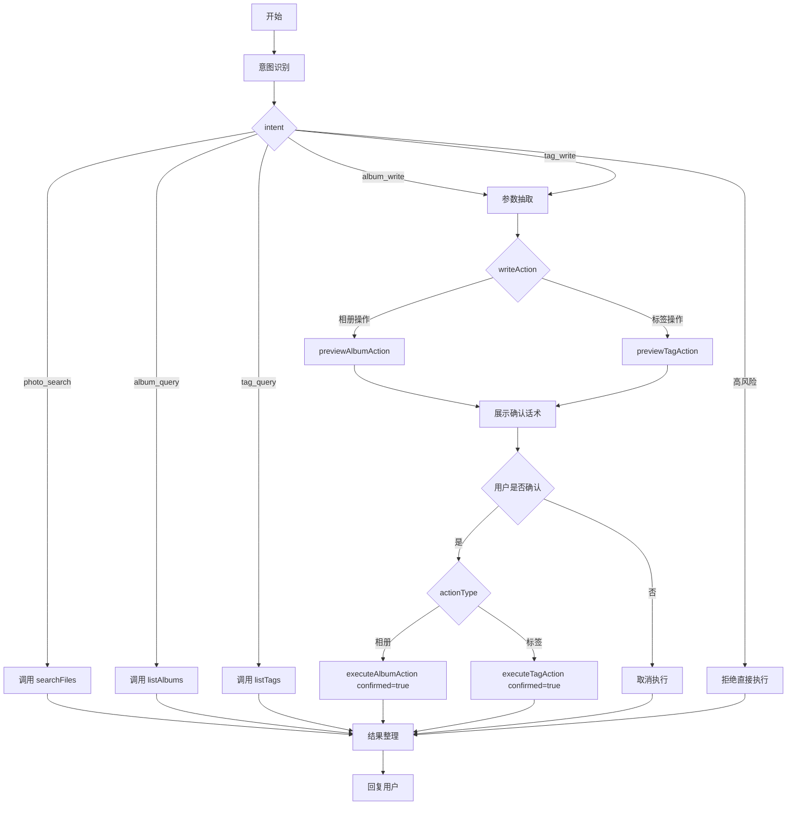

# Cloud-Album Dify 写操作工作流配置

这份指南用于把“云忆相册助手”从只读问答升级为“确认后可执行整理操作”的 Chatflow。

## 工具准备

重新导入：

```text
docs/dify-agent-openapi.yaml
```

确认 Dify 工具列表里出现这些 operation：

- `searchFiles`
- `listAlbums`
- `listTags`
- `previewAlbumAction`
- `executeAlbumAction`
- `previewTagAction`
- `executeTagAction`

执行类工具必须只放在“用户确认”分支之后。

## 推荐节点



## 意图识别节点

建议让 LLM 输出 JSON，温度调低。

```text
你需要判断用户意图，只输出 JSON，不要输出 Markdown。

intent 只能是：
- photo_search
- album_query
- tag_query
- album_write
- tag_write
- help_qa
- unsupported

高风险请求包括：删除照片、删除相册、清空回收站、创建分享链接、下载 token、修改账号。高风险一律输出 unsupported。

输出格式：
{
  "intent": "",
  "riskLevel": "low|medium|high",
  "needSearchFirst": false,
  "writeAction": "",
  "filters": {
    "tagName": "",
    "locationLevel": "",
    "locationValue": "",
    "albumName": "",
    "albumId": null,
    "imageTypeText": "all"
  }
}
```

## 写操作参数抽取节点

当用户说“把这些照片”“刚才那些”“搜索结果里的照片”时，优先使用上一轮 `searchFiles` 返回结果中的 `fileId`。如果没有可用 `fileId`，先调用 `searchFiles` 获取候选照片，不要直接执行。

按标签选择照片时统一使用 `searchType=tag` 和 `searchKeyword`。多个标签用 `|` 分隔，后端按并集匹配并自动去重，例如 `小猫|仓鼠|橘猫|萨摩耶`。`mediaType` 留空，不能与 `searchKeyword` 重复。语义类别生成的标签必须同类，“动物相关”不得混入日落、风景、地点或活动标签。

用户明确说“刚上传的照片”“最新上传的一张”时使用 `searchType=latest`，由后端选取当前用户最近上传且未删除的 1 张照片。不能把准备新增的标签当成检索条件，否则新标签尚不存在时永远无法定位照片。Dify 聊天附件与相册文件没有 `fileId` 关联，不能宣称已检查或修改聊天附件。

相册操作输出：

```json
{
  "action": "create_album_and_add_files",
  "albumName": "上海猫猫",
  "albumId": null,
  "fileIds": [],
  "confirmed": false
}
```

支持的相册 action：

- `create_album`
- `create_album_and_add_files`
- `add_files_to_album`
- `remove_files_from_album`

标签操作输出：

```json
{
  "action": "add_tags",
  "tagName": "猫",
  "imageType": "动物",
  "fileIds": [],
  "confirmed": false
}
```

支持的标签 action：

- `add_tags`
- `remove_tags`

## 预览节点

相册写操作调用：

```text
previewAlbumAction
```

标签写操作调用：

```text
previewTagAction
```

把返回的 `data.confirmationPrompt` 原样展示给用户。若 `data.warnings` 非空，也一起展示。

## 确认判断节点

建议判断用户最新回复。

确认词：

```text
确认、执行、确认执行、开始执行、可以执行、同意执行
```

确认必须是用户整条回复的独立含义，不能只靠句子中出现“是”“好”“可以”等词判断。任何包含相册名、标签名、筛选范围或修改语义的回复都必须重新预览。例如上一轮目标是“宠物相册”，用户回复“是宠物这个相册”表示把相册名改成“宠物”，不能直接执行。

取消词：

```text
取消、不要、算了、等等、改一下、不执行
```

如果用户改变范围或参数，例如“只要前三张”“相册名改成旅行”，回到参数抽取并重新调用预览。

“是放到宠物相册里”“系统已经有宠物相册了”“改成叫宠物”都属于补充或纠正条件，不是对上一轮方案的纯确认。只有“确认”“可以执行”“就这样”等没有附带新条件的短回复才进入执行节点。

预览回复只展示用户关心的信息：匹配到多少张照片、要放到哪里、会做什么、是否需要确认。不要展示 `Pending params`、JSON、内部字段名、动作代码或文件 ID。若匹配数量为 0，直接说明没有找到，并建议用户换用已有标签或更具体的筛选词，不进入确认。

## 执行节点

相册执行调用：

```json
{
  "action": "{{preview.action}}",
  "albumName": "{{preview.albumName}}",
  "albumId": "{{preview.albumId}}",
  "fileIds": "{{preview.fileIds}}",
  "confirmed": true
}
```

标签执行调用：

```json
{
  "action": "{{preview.action}}",
  "tagName": "{{preview.tagName}}",
  "imageType": "其他",
  "fileIds": "{{preview.fileIds}}",
  "confirmed": true
}
```

执行成功后，用 `data.message`、`data.affectedFileCount`、`data.albumName` 或 `data.tagName` 整理成一句自然语言回复。

## 验收用例

1. `给刚才查到的照片加标签 测试`
   - 应先预览。
   - 用户确认后调用 `executeTagAction`。

2. `把上海的照片建个相册叫 上海旅行`
   - 先 `searchFiles` 查询上海照片。
   - 再 `previewAlbumAction`。
   - 确认后 `executeAlbumAction`。

3. `把所有照片删掉`
   - 必须拒绝直接执行。
   - 可以建议先筛选照片清单。

4. `创建一个相册叫 测试相册`
   - 可直接预览 `create_album`。
   - 确认后执行。

## 当前本地调试注意

如果 `backend/src/main/resources/application.yml` 中：

```yaml
agent:
  auth-enabled: false
  dev-user-id: 1000000012
```

那么 Dify 写操作会作用到 `dev-user-id` 对应用户。生产环境必须改回：

```yaml
agent:
  auth-enabled: true
```
