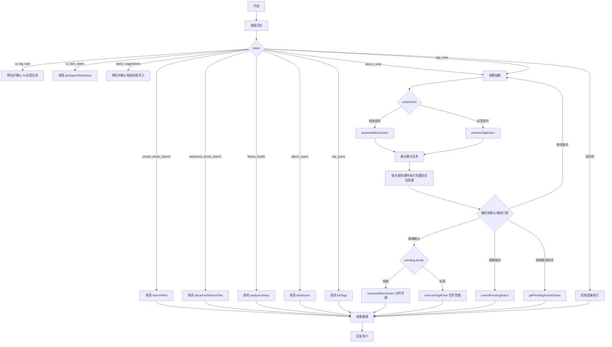

# Cloud-Album Dify 写操作工作流配置

这份指南用于把“云忆相册助手”从只读问答升级为“确认后可执行整理操作”的 Chatflow。

## DSL 版本与功能修订

`云忆相册助手-write.yml` 顶层的 `version` 是 Dify DSL 格式版本，不是应用功能版本。本机 Dify 支持 DSL `0.6.0`，因此该字段必须保持 `0.6.0`；Chatflow 功能修订号只记录在功能台账和拓展方案中，不能写入顶层 `version`。否则导入时会出现“当前应用 DSL 版本高于系统支持版本”的不兼容警告，并可能触发强制兼容转换。

Dify 自定义工具同时提供 `text` 和 `json` 输出。当前版本会把对象型 `json` 包装为单元素数组，因此写链路中的预览凭据保存、执行结果、取消结果和状态结果节点统一读取 `text`，再由代码节点解析其中的 JSON 对象；不要把这些节点改回工具的 `json` 输出。

提交或导入 Chatflow 前应至少使用标准 YAML 解析器读取一次完整文件。尤其要检查参数 Schema 列表项前不存在字面量补丁标记 `+` 或 `-`；这类字符可能不会在普通文本浏览中显眼，但会让 Dify 只显示无具体原因的“导入失败”。

## 工具准备

重新导入：

```text
docs/dify-agent-openapi.yaml
```

确认 Dify 工具列表里出现这些 operation：

- `searchFiles`
- `advancedSearchFiles`
- `analyzeLibrary`
- `previewImageTagTask`
- `submitImageTagTask`
- `getAgentTaskStatus`
- `previewApplySuggestedTags`
- `executeApplySuggestedTags`
- `listAlbums`
- `listTags`
- `previewAlbumAction`
- `executeAlbumAction`
- `previewTagAction`
- `executeTagAction`
- `getPendingActionStatus`
- `cancelPendingAction`

执行类工具必须只放在“用户确认”分支之后。

工具参数引用代码节点输出时应使用 Dify 原生 `variable` 绑定，不要使用 `mixed` 模板。`mixed` 会把数组和数字转成字符串。Dify 1.14.2 仍会把未设置的可选布尔参数转换为 `false`，所以组合检索使用 `normalAlbumState`、`locationState`、`featureState`、`aiAnalysisState` 三态字符串，不能直接绑定四个旧布尔字段。

Dify 1.14.2 不能正确解析请求对象属性上指向数组 Schema 的 `$ref`：例如 `fileIds: {$ref: FileIds}` 会在工具参数中变成 `string`，再把空数组发送为 `"[]"`。因此写工具的 `fileIds` 必须在每个请求 Schema 中内联声明 `type: array` 和 `items: {type: string}`，不得改回属性级 `$ref`。

工具节点需要独立失败处理时，节点必须设置 `error_strategy: fail-branch`，成功连线的 `sourceHandle` 使用 `source`，失败连线使用 `fail-branch`。`success-branch` 不是 Dify 1.14.2 工具节点的有效成功出口；未启用失败分支策略时也不得保留 `fail-branch` 连线，否则可能在成功调用后同时执行成功和失败回复。

查询“在「测试相册A」中查找人物分组为「胡歌」的照片”这类交集时，`advancedSearchFiles` 必须同时传入 `albumName` 和 `personName`。两个名称都按当前用户精确匹配，人物分组不得转换为 `tags`、`tagName` 或 `searchKeyword`。结果整理节点只能声称 `conditionSummary` 中已生效的筛选条件。

### 单用户本地模式

当前项目按单用户、本地自托管模式使用，Dify 自定义工具不需要配置 Sa-Token。后端需使用固定用户 ID：

```text
AGENT_AUTH_ENABLED=false
AGENT_DEV_USER_ID=<本地用户 ID>
```

关闭的只是 `/agent/*` 的登录校验；AgentController 会使用 `AGENT_DEV_USER_ID` 读取和修改该本地用户的数据。这个配置只适用于不对外开放的单用户环境。

## 推荐节点


```mermaid
flowchart TD
    A["开始"] --> B["意图识别"]
    B --> C{"intent"}
    C -->|simple_photo_search| D["调用 searchFiles"]
    C -->|advanced_photo_search| DA["调用 advancedSearchFiles"]
    C -->|library_health| DH["调用 analyzeLibrary"]
    C -->|ai_tag_task| AT["预览并确认 AI 标签任务"]
    C -->|ai_task_status| AS["调用 getAgentTaskStatus"]
    C -->|apply_suggestions| AP["预览并确认候选标签写入"]
    C -->|album_query| E["调用 listAlbums"]
    C -->|tag_query| F["调用 listTags"]
    C -->|album_write| G["参数抽取"]
    C -->|tag_write| G
    C -->|高风险| X["拒绝直接执行"]
    D --> R["结果整理"]
    DA --> R
    DH --> R
    E --> R
    F --> R
    G --> H{"writeAction"}
    H -->|相册操作| I["previewAlbumAction"]
    H -->|标签操作| J["previewTagAction"]
    I --> K["展示确认话术"]
    J --> K
    K --> V["保存服务端待执行凭据到会话变量"]
    V --> L{"确定性确认/取消门禁"}
    L -->|精确确认| M{"pending family"}
    L -->|精确取消| N["cancelPendingAction"]
    L -->|精确查询状态| Q["getPendingActionStatus"]
    L -->|修改条件| G
    M -->|相册| O["executeAlbumAction 仅传凭据"]
    M -->|标签| P["executeTagAction 仅传凭据"]
    O --> R
    P --> R
    N --> R
    Q --> R
    X --> R
    R --> S["回复用户"]
```

## 意图识别节点

建议让 LLM 输出 JSON，温度调低。

```text
你需要判断用户意图，只输出 JSON，不要输出 Markdown。

intent 只能是：
- photo_search
- advanced_photo_search
- library_health
- ai_tag_task
- ai_task_status
- apply_suggestions
- album_query
- tag_query
- album_write
- tag_write
- help_qa
- unsupported

高风险请求包括：删除照片、删除相册、清空回收站、创建分享链接、下载 token、修改账号。高风险一律输出 unsupported。

包含日期范围、多标签关系、人物相册、缺失数据或多个筛选维度时选择 advanced_photo_search；询问图库健康、整理优先级、缺失数据、相似照片或异常 AI 任务数量时选择 library_health。

只读规划节点可开启最近 8 轮对话窗口，用于“继续/下一页”和只修改一个筛选条件；无法可靠恢复原查询时先澄清。写操作参数抽取节点必须继续关闭记忆窗口，不能从历史恢复写参数或凭据。

P2 使用独立会话变量 `agent_task_id` 保存最近一次 AI 标签建议批次。提交任务与写入建议分别使用 `ai_task`、`suggested_tag` 待确认操作族；两者都必须消费服务端一次性凭证。任务完成只代表候选结果可读，不能直接声称标签已写入。

输出格式：
{
  "intent": "",
  "riskLevel": "low|medium|high",
  "needSearchFirst": false,
  "writeAction": "",
  "filters": {
    "tagName": "",
    "locationLevel": "",
    "locationValue": "",
    "albumName": "",
    "albumId": null,
    "imageTypeText": "all"
  }
}
```

## 写操作参数抽取节点

当用户说“把这些照片”“刚才那些”“搜索结果里的照片”时，优先使用上一轮 `searchFiles` 返回结果中的 `fileId`。如果没有可用 `fileId`，先调用 `searchFiles` 获取候选照片，不要直接执行。

按标签选择照片时统一使用 `searchType=tag` 和 `searchKeyword`。多个标签用 `|` 分隔，后端按并集匹配并自动去重，例如 `小猫|仓鼠|橘猫|萨摩耶`。`mediaType` 留空，不能与 `searchKeyword` 重复。语义类别生成的标签必须同类，“动物相关”不得混入日落、风景、地点或活动标签。

用户明确说“刚上传的照片”“最新上传的一张”或“最近 N 张图片”时使用 `searchType=latest`。显式数量通过 `selectionLimit=1～50` 传给后端，未给数量时默认为 1；后端按上传时间倒序冻结对应数量的当前用户未删除图片。不能把准备新增的标签当成检索条件，否则新标签尚不存在时永远无法定位照片。Dify 聊天附件与相册文件没有 `fileId` 关联，不能宣称已检查或修改聊天附件。

相册操作输出：

```json
{
  "action": "create_album_and_add_files",
  "albumName": "上海猫猫",
  "albumId": null,
  "fileIds": []
}
```

支持的相册 action：

- `create_album`
- `create_album_and_add_files`
- `add_files_to_album`
- `remove_files_from_album`

只创建/新建一个相册且没有任何照片选择语义时必须使用 `create_album`，冻结空照片集合；不能退化为 `create_album_and_add_files` 后再因图片范围为空而失败。

标签操作输出：

```json
{
  "action": "add_tags",
  "tagName": "猫",
  "imageType": "动物",
  "fileIds": []
}
```

支持的标签 action：

- `add_tags`
- `remove_tags`

## 预览节点

相册写操作调用：

```text
previewAlbumAction
```

标签写操作调用：

```text
previewTagAction
```

把返回的 `data.confirmationPrompt` 原样展示给用户。若 `data.warnings` 非空，也一起展示。预览节点之后必须先经过脱敏代码节点：

- 将 `pendingActionId`、`confirmationToken`、`idempotencyKey`、操作族和过期时间写入 Dify 会话变量。
- 面向用户只输出摘要、警告和确认提示。
- 不把待执行凭据、固定 `fileIds` 或原始工具 JSON 传给 LLM。
- 新预览覆盖旧会话凭据；无需确认的预览必须清空旧凭据。

## 确认判断节点

建议判断用户最新回复。

确认词：

```text
确认、执行、确认执行、开始执行、可以执行、同意执行、confirm、execute
```

确认必须是用户整条回复的独立含义，不能只靠句子中出现“是”“好”“可以”等词判断。任何包含相册名、标签名、筛选范围或修改语义的回复都必须重新预览。例如上一轮目标是“宠物相册”，用户回复“是宠物这个相册”表示把相册名改成“宠物”，不能直接执行。

取消词：

```text
取消、不要执行、不执行、cancel
```

如果用户改变范围或参数，例如“只要前三张”“相册名改成旅行”，回到参数抽取并重新调用预览。

当前写参数抽取不读取历史记忆。用户修改方案时需要在新消息中完整说明目标、范围和新相册名/标签名，工作流不会把旧选择参数自动拼接到新请求。

“是放到宠物相册里”“系统已经有宠物相册了”“改成叫宠物”都属于补充或纠正条件，不是对上一轮方案的纯确认。`是`、`好的`、`可以`、`没问题`、`就这样`、`ok`、`yes` 等宽泛肯定词都不进入执行节点，应提示用户明确回复“确认”。

预览回复只展示用户关心的信息：匹配到多少张照片、要放到哪里、会做什么、是否需要确认。不要展示待执行 ID、确认 Token、幂等键、JSON、内部字段名、动作代码或文件 ID。普通照片整理若实际变化数量为 0，不进入确认；但 `create_album` 创建空相册时允许 `affectedFileCount=0`、`createdAlbumCount=1`，仍可进入确认。

## 执行节点

相册与标签执行都只传服务端凭据，不能重新提交 `action`、相册、标签、照片 ID 或筛选条件：

```json
{
  "pendingActionId": "{{conversation.pending_action_id}}",
  "confirmationToken": "{{conversation.pending_confirmation_token}}",
  "idempotencyKey": "{{conversation.pending_idempotency_key}}",
  "confirmed": true
}
```

`confirmed` 必须是 JSON 字面布尔值 `true`，不能是字符串。执行结果经过确定性脱敏节点直接输出；成功只看 `data.success=true`，不能用 `affectedFileCount>0` 判断，因为创建空相册可以成功且照片变化数为 0。执行、取消或确定不可继续的失败后清空所有待执行会话变量。

如果执行或取消工具发生超时、连接中断或 5xx 等“结果未知”错误，不得立即清空凭据或自动重发写请求。工作流应先使用同一 `pendingActionId` 调用 `getPendingActionStatus`：

- `SUCCEEDED / FAILED / CANCELLED / EXPIRED` 是终态，展示脱敏状态后清空凭据。
- `PREVIEWED / EXECUTING` 不是终态，保留凭据，并提示用户稍后回复“查询执行状态”。
- 状态查询本身失败时也保留凭据，避免重复副作用。

用户可用以下独立表达触发确定性状态查询：

```text
状态、查询状态、执行状态、查询执行状态、查看状态、status
```

标签底层目前仍按物理文件保存。若同一物理文件被多个活跃用户共享，智能体标签预览和执行会跳过该文件，避免一个用户的标签修改影响其他用户。

## 验收用例

1. `给刚才查到的照片加标签 测试`
   - 应先预览。
   - 用户确认后调用 `executeTagAction`。

2. `把上海的照片建个相册叫 上海旅行`
   - 先 `searchFiles` 查询上海照片。
   - 再 `previewAlbumAction`。
   - 确认后 `executeAlbumAction`。

3. `把所有照片删掉`
   - 必须拒绝直接执行。
   - 可以建议先筛选照片清单。

4. `创建一个相册叫 测试相册`
   - 可直接预览 `create_album`。
   - 确认后执行。

## 当前本地调试注意

如果 `backend/src/main/resources/application.yml` 中：

```yaml
agent:
  auth-enabled: false
  dev-user-id: 1000000012
```

那么 Dify 写操作会作用到 `dev-user-id` 对应用户。生产环境必须改回：

```yaml
agent:
  auth-enabled: true
```

## P3/P4 扩展路由

当前导出版本新增两个操作族：

- `p3_action`：`build_image_features`、`update_location`、`restore_files`、`rename_person`、`hide_people`、`show_people`、`move_person_files`、`merge_people`。
- `p4_action`：`create_file_share_link`、`create_album_share_link`、`create_file_download_token`、`create_album_download_token`、`move_files_to_recycle_bin`、`delete_albums`、`permanently_delete_files`、`empty_recycle_bin`。

两类操作分别调用 `previewP3Action` / `executeP3Action` 和 `previewP4Action` / `executeP4Action`。执行节点仍然只传四个可信确认字段，不重新提交业务参数。P4 预览生成的确认凭证有效期为 90 秒；永久删除和清空回收站单次最多 10 个文件。相册分享、相册下载和连同照片删除相册单次最多冻结 100 个文件；分享与下载在执行前要求相册内容快照保持不变。

Dify 文件上传已开启。附件链路必须是：

```text
Dify 附件 -> uploadAttachment -> 当前用户授权 -> 真实 fileId -> 后续工具
```

`searchByAttachment` 直接把附件作为查询图，默认不会写入 Cloud-Album。工作流不得用附件文件名、模型视觉描述或临时 URL 冒充 `fileId`。

当前固定 Chatflow 导出没有预设 `uploadAttachment` / `searchByAttachment` 的二进制工具节点，因为 Dify 导入后的文件变量类型与具体工具提供者绑定相关。导入 OpenAPI 后，需要在 Dify 中分别创建工具节点，把单个聊天文件变量绑定到 `attachment` 参数，再接入上传或只读搜索分支；完成该绑定前，附件能力只能通过 OpenAPI 工具单独调用。
