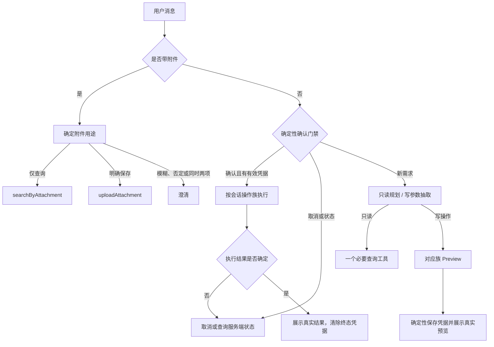

# Cloud-Album Dify 写操作工作流指南

最近对照代码更新：2026-10-02。本文描述当前个人版实现，不代表本次重新完成在线验收。环境与导入步骤见 [个人版导入说明](dify-personal-import-2026-09-14.md)，历史验证范围见 [交付记录](agent-personal-delivery-2026-09-14.md)。

## 版本与鉴权

- Dify DSL 顶层 `version: 0.6.0` 是格式版本；OpenAPI 为 `5.0.7`，后端待执行契约为 `1.6.0`，不可混用。
- 除公开能力清单，浏览器调用需要有效 Sa-Token；Dify 使用 `X-Agent-Service-Key`，绑定 `AGENT_OWNER_USER_ID`。旧的 `AGENT_AUTH_ENABLED=false` / `AGENT_DEV_USER_ID` 已失效，不存在匿名固定用户回退。
- 后端与 AI 通过另一把 `AI_SERVICE_KEY` 鉴权，根目录 `.env` 为共同配置入口。凭据不能进入模型提示词、工具业务参数或前端变量。
- 每个工具的 query 参数 `conversationId` 原生绑定 `sys.conversation_id`。服务端按“主人账号 + 会话 + 工作流版本”绑定确认记录；新预览仅替换同账号同会话的旧有效预览，不影响其他会话。

## 当前工作流结构

普通查询由规划器选择一个必要工具；写请求由参数抽取和确定性校验生成真实服务端预览。确认、取消、状态、附件各有独立分支。不要把完整说明简单粘贴进单一 LLM 节点以替代这些保护。


```mermaid
flowchart TD
    A["用户消息"] --> B{"是否带附件"}
    B -->|是| C["确定附件用途"]
    C -->|仅查询| D["searchByAttachment"]
    C -->|明确保存| E["uploadAttachment"]
    C -->|模糊、否定或同时两项| F["澄清"]
    B -->|否| G{"确定性确认门禁"}
    G -->|确认且有有效凭据| H["按会话操作族执行"]
    G -->|取消或状态| I["取消或查询服务端状态"]
    G -->|新需求| J["只读规划 / 写参数抽取"]
    J -->|只读| K["一个必要查询工具"]
    J -->|写操作| L["对应族 Preview"]
    L --> M["确定性保存凭据并展示真实预览"]
    H --> N{"执行结果是否确定"}
    N -->|否| I
    N -->|是| O["展示真实结果，清除终态凭据"]
```

操作族与工具：

| 操作族 | 预览 | 确认后执行 |
| --- | --- | --- |
| `album` | `previewAlbumAction` | `executeAlbumAction` |
| `tag` | `previewTagAction` | `executeTagAction` |
| `ai_task` | `previewImageTagTask` | `submitImageTagTask` |
| `suggested_tag` | `previewApplySuggestedTags` | `executeApplySuggestedTags` |
| `p3_action` | `previewP3Action` | `executeP3Action` |
| `p4_action` | `previewP4Action` | `executeP4Action` |

具体动作决定 P3/P4 操作族；不能依赖模型给出的错误族名将恢复操作送到删除接口。维护脚本 `scripts/dify/repair_workflow.py` 将确定性节点源码同步到 DSL；仓库文件变化仍需用户导入并发布到 Dify。

## 参数与 Dify 兼容约束

导入 [OpenAPI](dify-agent-openapi.yaml) 后保留以下规则，这些是本项目针对 Dify 1.14.2 的兼容处理：

- 工具参数使用原生 `variable`，不用 `mixed` 模板传数组或数字。`fileIds` 在请求 Schema 中保留内联 `type: array` 与字符串 `items`，避免属性级 `$ref` 被误识别为字符串。
- 组合查询使用 `normalAlbumState`、`locationState`、`featureState`、`aiAnalysisState` 字符串三态，避免未设置的可选布尔被转成 `false`。
- 工具结果整理读取 `text`，由确定性代码解析 JSON；当前适配处理了工具 `json` 可能被包装为单元素数组的差异。
- 工具失败策略为 `error_strategy: fail-branch`；成功边为 `source`，失败边为 `fail-branch`。`success-branch` 不是这里的工具成功出口。
- `conversationId` 声明在各 operation 上并绑定系统会话 ID，不能只放 path 级参数或业务 JSON 中。
- 预览/执行凭据不进入 LLM；用户可见结果显示真实文件名和影响，不能展示密钥、确认 Token 或幂等键。

## 照片选择与预览

相册动作包括 `create_album`、`create_album_and_add_files`、`add_files_to_album`、`remove_files_from_album`；标签动作包括 `add_tags`、`remove_tags`。

- 只要求创建空相册时使用 `create_album`，允许照片数为 0，但仍需真实预览和确认。成功按 `data.success=true` 判断，不能要求 `affectedFileCount>0`。
- “最近 N 张”使用 `searchType=latest` 与 `selectionLimit`，相册/标签最多 100 张，P2 标签任务最多 50 张。不能用准备新增的标签反向检索。
- 精确标签条件使用 `searchKeyword`，多个标签用 `|` 表示并集，`mediaType` 不承载标签条件。候选标签必须符合用户语义类别。
- 普通相册与人物分组交集查询使用 `albumName` 与 `personName`，不能把人物分组名改写成标签。只转述工具 `conditionSummary` 中实际生效的条件。
- “这些照片”必须有工具返回的真实文件标识；没有可靠范围先检索或澄清。不能从附件名、视觉描述或旧写操作历史编造文件标识。
- 查询规划可使用最近 8 轮只读上下文处理继续/下一页；写参数抽取不恢复历史参数。修改方案需完整重述新目标与范围，重新预览。

预览返回的 `confirmationPrompt`、警告和照片范围由确定性节点展示。仅有效且有实际变化的预览签发并保存 `pendingActionId`、`confirmationToken`、`idempotencyKey`、操作族和有效期；无变化预览不应覆盖仍有效的既有确认。普通确认默认 300 秒，P4 为 90 秒。照片和操作载荷在服务端冻结。

共享物理文件若仍有其他活跃用户持有，标签修改会安全跳过；必须展示实际跳过数，不能声称已写入。

## 确认、取消和未知结果

只有整条当前回复规范化后精确匹配以下之一，且当前会话持有有效服务端预览，才允许进入执行：

```text
确认、执行、确认执行、开始执行、可以执行、同意执行、confirm、execute
```

“是”“好的”“可以”“没问题”“就这样”“ok”“yes”不能触发执行。带相册名、标签、范围或动作修改的回复必须重新预览，即使包含“确认”。

执行的业务 JSON 仅包含：

```json
{
  "pendingActionId": "<来自当前会话的预览>",
  "confirmationToken": "<来自当前会话的预览>",
  "idempotencyKey": "<来自当前会话的预览>",
  "confirmed": true
}
```

`confirmed` 为 JSON 布尔值；另通过 query 传相同 `conversationId`。执行不能重新提交 `action`、`fileIds`、相册或标签等业务参数。

独立回复“取消 / 不要执行 / 不执行 / cancel”走 `cancelPendingAction`；“状态 / 查询状态 / 执行状态 / 查询执行状态 / 查看状态 / status”走 `getPendingActionStatus`。

执行或取消超时、断网、5xx 后不能自动重放写入，也不能直接清空凭据。先查询同一待执行记录：

- `SUCCEEDED / FAILED / CANCELLED / EXPIRED`：展示真实终态并清除会话凭据。
- `PREVIEWED / EXECUTING`：保留凭据，提示稍后查询状态。
- 状态查询也失败：保留凭据，明确结果未知。

## 回收站与 P3/P4

P3 动作：特征提取、地点修正、回收站恢复、人物重命名/隐藏/恢复显示/移动/合并。P4 动作：分享、下载授权、移入回收站、删除相册，以及已有的永久删除和清空回收站实现。后两项真实操作验收延期，不应作为日常冒烟步骤。

普通“删除相册里的图片”先走 `move_files_to_recycle_bin`，由当前用户唯一相册名解析真实目标；模糊、多相册或带子集筛选条件时先澄清/检索，不能扩大为全部照片。

“把回收站的照片恢复”使用 `restore_files` 与显式 `allRecycleImages=true`，只冻结当前主人的回收站图片，最多 50 张。空 `fileIds` 本身不表示恢复全部；无可恢复图片不签发确认，超过上限要求缩小范围。软删除与恢复保留标签、相册成员/封面及相似关系。

P4 的文件分享/下载/移入回收站最多 20 个目标；删除相册最多 5 个；相册分享、相册下载及连同照片删除最多冻结 100 个文件；永久删除/清空回收站最多 10 个。分享有效期 1～30 天。分享/下载使用持久化授权，执行前校验范围和所有权，不能把预览当作已经生成有效链接。

## 附件与前端会话

当前 DSL 已包含上传、以图搜图两个二进制工具节点，无需从零创建：

```text
sys.files → 提取本次附件.first_record → attachment multipart 参数
           → 查询：searchByAttachment，不保存图库
           → 明确保存：uploadAttachment，成功返回真实 fileId
```

列表节点保留 `var_type: array[file]` 和 `item_var_type: file`。界面允许单张 JPG/JPEG/PNG/GIF/WEBP；“查找和这张图相似度最高的图片”等自然语言进入查询分支，“保存这张图片”进入明确授权的直接上传分支。附件上传是预览确认机制的明确例外；不要把单纯附图视为保存授权。否定、混合保存与查询或意图不明先澄清。

只有后端明确返回成功且含真实 `fileId`，才能保存附件标识供后续使用。失败或响应未知不能声称已保存；保存先检查图库，查询可以重试。附件标识不替代后续写操作所需的真实预览。

前端 `AgentAssistant.vue` 使用完整 `/chat/` WebApp，提供历史会话菜单与单图上传入口；旧 `/chatbot/` 地址自动转换。关掉浮窗保留 iframe，“操作记录与照片”页读取后端活动及后台任务。地址可在浏览器设置或根目录 `.env` 的 `VITE_DIFY_AGENT_URL` 配置，不在 `frontend/.env` 配置服务密钥。

## 当前边界

相似发现已改为持久化后台任务，工具响应只证明受理，完成状态及候选组在操作记录中查看，候选不代表可自动删除。个人版保留现有实现，不继续扩展企业、多租户、角色和多人功能。

2026-09-14 已有后端/AI/评测/构建、隔离迁移及有限业务冒烟证据；2026-09-15 另有对话和回收站修复记录。完整 Dify 导入与在线验收、完整 92 条业务评测、附件保存全流程及全部 P3/P4 真实操作仍不应宣称验收完成。此次文档更新未运行任何测试或启动服务。
